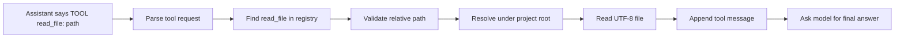

# Chapter 7: Read Project Files

## Where We Are

Chapter 6 gave `ty-term` a real agent-loop shape:

```text
user: use the cwd tool
assistant: TOOL cwd
tool cwd: /path/to/project
assistant: saw tool cwd: /path/to/project
```

The model can ask for an allowlisted tool, the harness can execute it, and the result goes back into the conversation.

But `cwd` is mostly a heartbeat. It proves the loop works, but it does not let the model inspect the project. A coding harness cannot reason about code it cannot read.

This chapter adds the first useful read-only project capability:

```text
TOOL read_file: package.json
```

The tool reads UTF-8 text from inside the project root and rejects unsafe paths.

## Learning Objective

Learn the first filesystem safety boundary for a coding agent:



The important idea is not `fs.readFile`. The important idea is this invariant:

> The model may name a project-relative file, but it may not choose an arbitrary path on the machine.

That means:

- `package.json` is allowed.
- `src/index.ts` is allowed.
- `/etc/passwd` is rejected.
- `../secret.txt` is rejected.
- `subdir/../note.txt` is allowed if it normalizes inside the project.

## Why File Reading Comes Next

Chapter 5 added a manual `bash` tool. Chapter 6 deliberately kept `bash` away from the model.

That split continues here. A model-driven shell can mutate files, install packages, delete data, or hang. A model-driven file reader is still powerful, but it is read-only and much easier to reason about.

So the model registry becomes:

- `cwd`
- `read_file`

The manual registry becomes:

- `cwd`
- `bash`
- `read_file`

The registry is the capability boundary.

## Build The Slice

Change three files:

- `src/index.ts`
- `src/cli.ts`
- `tests/agent.test.ts`

No new dependencies are needed. Chapter 1 already installed the full dependency set.

## `src/index.ts`

Replace the file with this version:

```ts
import { spawn } from "node:child_process";
import { readFile } from "node:fs/promises";
import path from "node:path";
import OpenAI from "openai";

export type AgentRole = "user" | "assistant" | "tool";

export interface AgentMessage {
  role: AgentRole;
  content: string;
  name?: string;
}

export type Conversation = AgentMessage[];

export interface ModelClient {
  createResponse(prompt: string, conversation: Conversation): Promise<string>;
}

export interface ToolDefinition {
  name: string;
  description: string;
  execute(input?: string): Promise<string>;
}

export type ToolRegistry = ReadonlyMap<string, ToolDefinition>;

export interface ToolRequest {
  name: string;
  input?: string;
}

export interface CommandOptions {
  cwd?: string;
  timeoutMs?: number;
}

export interface ReadFileOptions {
  projectRoot?: string;
}

export function createUserMessage(content: string): AgentMessage {
  return { role: "user", content };
}

export function createAssistantMessage(content: string): AgentMessage {
  return { role: "assistant", content };
}

export function createToolMessage(name: string, content: string): AgentMessage {
  return { role: "tool", name, content };
}

export function createEchoModelClient(): ModelClient {
  return {
    async createResponse(
      prompt: string,
      conversation: Conversation,
    ): Promise<string> {
      const latestMessage = conversation.at(-1);

      if (latestMessage?.role === "tool") {
        return `saw tool ${latestMessage.name}: ${latestMessage.content}`;
      }

      const normalizedPrompt = prompt.toLowerCase();

      if (
        normalizedPrompt.includes("use the cwd tool") ||
        normalizedPrompt.includes("run pwd")
      ) {
        return "TOOL cwd";
      }

      const readFileMatch = prompt.match(/read (?:the )?file ([^\n]+)/i);

      if (readFileMatch) {
        return `TOOL read_file: ${readFileMatch[1].trim()}`;
      }

      return `agent heard: ${prompt}`;
    },
  };
}

export function createOpenAIModelClient(
  model = process.env.OPENAI_MODEL ?? "gpt-4.1-mini",
): ModelClient {
  const client = new OpenAI();

  return {
    async createResponse(
      prompt: string,
      conversation: Conversation,
    ): Promise<string> {
      const contextText = conversation
        .map((message) => {
          if (message.role === "tool") {
            return `tool ${message.name}: ${message.content}`;
          }

          return `${message.role}: ${message.content}`;
        })
        .join("\n");

      const response = await client.responses.create({
        model,
        instructions: [
          "You are connected to a tiny learning harness.",
          "If you need the current working directory, respond exactly: TOOL cwd",
          "If you need to read a project file, respond exactly: TOOL read_file: relative/path.txt",
          "Only request relative project file paths.",
          "Do not request bash commands.",
          "After a tool result appears, answer the user in normal text.",
        ].join("\n"),
        input: [contextText, prompt]
          .filter((part) => part.length > 0)
          .join("\n"),
      });

      return response.output_text;
    },
  };
}

export async function runTurn(
  conversation: Conversation,
  prompt: string,
  modelClient: ModelClient,
): Promise<Conversation> {
  const userMessage = createUserMessage(prompt);
  const assistantContent = await modelClient.createResponse(
    prompt,
    conversation,
  );
  const assistantMessage = createAssistantMessage(assistantContent);

  return [...conversation, userMessage, assistantMessage];
}

export async function runTurnWithTools(
  conversation: Conversation,
  prompt: string,
  modelClient: ModelClient,
  toolRegistry: ToolRegistry,
): Promise<Conversation> {
  const userMessage = createUserMessage(prompt);
  const afterUser = [...conversation, userMessage];

  const assistantContent = await modelClient.createResponse(prompt, afterUser);
  const assistantMessage = createAssistantMessage(assistantContent);
  const afterAssistant = [...afterUser, assistantMessage];

  const toolRequest = parseToolRequest(assistantContent);

  if (!toolRequest) {
    return afterAssistant;
  }

  const toolResult = await executeTool(
    toolRegistry,
    toolRequest.name,
    toolRequest.input,
  );
  const toolMessage = createToolMessage(toolRequest.name, toolResult);
  const afterTool = [...afterAssistant, toolMessage];

  const finalAssistantContent = await modelClient.createResponse("", afterTool);
  const finalAssistantMessage = createAssistantMessage(finalAssistantContent);

  return [...afterTool, finalAssistantMessage];
}

export function parseToolRequest(text: string): ToolRequest | undefined {
  const match = text.trim().match(/^TOOL ([a-zA-Z0-9_-]+)(?:\s*:\s*(.*))?$/);

  if (!match) {
    return undefined;
  }

  const [, name, input] = match;

  return {
    name,
    input: input && input.length > 0 ? input : undefined,
  };
}

export function renderTranscript(conversation: Conversation): string {
  return conversation
    .map((message) => {
      if (message.role === "tool") {
        return `tool ${message.name}: ${message.content}`;
      }

      return `${message.role}: ${message.content}`;
    })
    .join("\n");
}

export function createCurrentDirectoryTool(options?: {
  cwd?: string;
}): ToolDefinition {
  const cwd = options?.cwd ?? process.cwd();

  return {
    name: "cwd",
    description: "Return the current working directory.",
    async execute() {
      return cwd;
    },
  };
}

export function resolveProjectRoot(projectRoot?: string): string {
  return path.resolve(projectRoot ?? process.env.INIT_CWD ?? process.cwd());
}

export async function executeCommand(
  command: string,
  options?: CommandOptions,
): Promise<string> {
  const timeoutMs = options?.timeoutMs ?? 5000;

  return new Promise((resolve, reject) => {
    let stdout = "";
    let stderr = "";
    let timedOut = false;

    const child = spawn(command, {
      cwd: options?.cwd,
      shell: true,
      stdio: ["ignore", "pipe", "pipe"],
    });

    const timeout = setTimeout(() => {
      timedOut = true;
      child.kill();
    }, timeoutMs);

    child.stdout.setEncoding("utf8");
    child.stderr.setEncoding("utf8");

    child.stdout.on("data", (chunk: string) => {
      stdout += chunk;
    });

    child.stderr.on("data", (chunk: string) => {
      stderr += chunk;
    });

    child.on("error", (error) => {
      clearTimeout(timeout);
      reject(error);
    });

    child.on("close", (code) => {
      clearTimeout(timeout);

      const exitCode = timedOut ? "timeout" : String(code ?? 0);

      resolve(
        [
          `exit code: ${exitCode}`,
          "stdout:",
          stdout.trimEnd(),
          "stderr:",
          stderr.trimEnd(),
        ].join("\n"),
      );
    });
  });
}

export function createBashTool(options?: CommandOptions): ToolDefinition {
  return {
    name: "bash",
    description: "Run a bash command and return exit code, stdout, and stderr.",
    async execute(input?: string) {
      if (!input || input.trim().length === 0) {
        throw new Error("bash tool requires a command.");
      }

      return executeCommand(input, options);
    },
  };
}

export function createReadFileTool(options?: ReadFileOptions): ToolDefinition {
  const projectRoot = resolveProjectRoot(options?.projectRoot);

  return {
    name: "read_file",
    description: "Read a UTF-8 text file from inside the project root.",
    async execute(input?: string) {
      if (!input || input.trim().length === 0) {
        throw new Error("read_file tool requires a relative path.");
      }

      const relativePath = input.trim();

      if (path.isAbsolute(relativePath)) {
        throw new Error("read_file path must be relative.");
      }

      const filePath = path.resolve(projectRoot, relativePath);
      const pathFromRoot = path.relative(projectRoot, filePath);

      if (
        pathFromRoot === ".." ||
        pathFromRoot.startsWith(`..${path.sep}`) ||
        path.isAbsolute(pathFromRoot)
      ) {
        throw new Error("read_file path must stay inside the project root.");
      }

      return readFile(filePath, "utf8");
    },
  };
}

export function createToolRegistry(
  tools: readonly ToolDefinition[],
): ToolRegistry {
  const registry = new Map<string, ToolDefinition>();

  for (const tool of tools) {
    if (registry.has(tool.name)) {
      throw new Error(`Duplicate tool name: ${tool.name}`);
    }

    registry.set(tool.name, tool);
  }

  return registry;
}

export function getTool(
  registry: ToolRegistry,
  name: string,
): ToolDefinition | undefined {
  return registry.get(name);
}

export async function executeTool(
  registry: ToolRegistry,
  name: string,
  input?: string,
): Promise<string> {
  const tool = getTool(registry, name);

  if (!tool) {
    throw new Error(`Unknown tool: ${name}`);
  }

  return tool.execute(input);
}
```

## The Project Root Detail

The new helper is small, but important:

```ts
export function resolveProjectRoot(projectRoot?: string): string {
  return path.resolve(projectRoot ?? process.env.INIT_CWD ?? process.cwd());
}
```

When you run a package script from `ty-term`, the script runs from the package root:

```text
ty-term
```

That is also the project root for this book:

```text
ty-term
```

The package manager sets `INIT_CWD` to the directory where the user launched the command. Using `INIT_CWD ?? process.cwd()` makes the tool read from the project root in normal use while staying easy to override in tests.

## The Path Boundary

The read tool rejects missing input:

```ts
if (!input || input.trim().length === 0) {
  throw new Error("read_file tool requires a relative path.");
}
```

It rejects absolute paths:

```ts
if (path.isAbsolute(relativePath)) {
  throw new Error("read_file path must be relative.");
}
```

Then it resolves the file under the project root and checks the normalized relative path:

```ts
const filePath = path.resolve(projectRoot, relativePath);
const pathFromRoot = path.relative(projectRoot, filePath);

if (
  pathFromRoot === ".." ||
  pathFromRoot.startsWith(`..${path.sep}`) ||
  path.isAbsolute(pathFromRoot)
) {
  throw new Error("read_file path must stay inside the project root.");
}
```

The check intentionally does not use `pathFromRoot.startsWith("..")`. That would reject a valid file like `..example` inside the project. The path is unsafe only when the normalized relative path is exactly `..`, starts with `../`, or becomes absolute.

## `src/cli.ts`

Replace the file with this version:

```ts
#!/usr/bin/env node
import {
  type Conversation,
  createBashTool,
  createCurrentDirectoryTool,
  createEchoModelClient,
  createOpenAIModelClient,
  createReadFileTool,
  createToolRegistry,
  executeTool,
  renderTranscript,
  resolveProjectRoot,
  runTurnWithTools,
} from "./index";

interface ParsedArgs {
  useOpenAI: boolean;
  toolName?: string;
  toolInput?: string;
  prompt: string;
}

function parseArgs(args: string[]): ParsedArgs {
  let useOpenAI = false;
  let toolName: string | undefined;
  let toolInput: string | undefined;
  const promptParts: string[] = [];

  for (let index = 0; index < args.length; index += 1) {
    const arg = args[index];

    if (arg === "--openai") {
      useOpenAI = true;
      continue;
    }

    if (arg === "--tool") {
      toolName = args[index + 1];
      toolInput = args.slice(index + 2).join(" ");
      break;
    }

    promptParts.push(arg);
  }

  return { useOpenAI, toolName, toolInput, prompt: promptParts.join(" ") };
}

async function main(): Promise<void> {
  const parsed = parseArgs(process.argv.slice(2));
  const projectRoot = resolveProjectRoot();

  if (parsed.toolName) {
    const registry = createToolRegistry([
      createCurrentDirectoryTool({ cwd: projectRoot }),
      createBashTool({ cwd: projectRoot }),
      createReadFileTool({ projectRoot }),
    ]);
    const result = await executeTool(
      registry,
      parsed.toolName,
      parsed.toolInput,
    );

    process.stdout.write(`tool ${parsed.toolName}:\n${result}\n`);
    return;
  }

  if (parsed.prompt.length === 0) {
    console.error('Usage: bun run dev -- [--openai] "your prompt"');
    process.exit(1);
  }

  if (parsed.useOpenAI && !process.env.OPENAI_API_KEY) {
    console.error("OPENAI_API_KEY is required when using --openai.");
    process.exit(1);
  }

  const modelClient = parsed.useOpenAI
    ? createOpenAIModelClient()
    : createEchoModelClient();
  const conversation: Conversation = [];
  const modelToolRegistry = createToolRegistry([
    createCurrentDirectoryTool({ cwd: projectRoot }),
    createReadFileTool({ projectRoot }),
  ]);
  const nextConversation = await runTurnWithTools(
    conversation,
    parsed.prompt,
    modelClient,
    modelToolRegistry,
  );

  process.stdout.write(`${renderTranscript(nextConversation)}\n`);
}

main().catch((error: unknown) => {
  const message = error instanceof Error ? error.message : String(error);
  process.stderr.write(`${message}\n`);
  process.exitCode = 1;
});
```

The CLI now makes the capability split explicit:

```ts
const registry = createToolRegistry([
  createCurrentDirectoryTool({ cwd: projectRoot }),
  createBashTool({ cwd: projectRoot }),
  createReadFileTool({ projectRoot }),
]);
```

That manual registry is used only when the human explicitly runs `--tool`.

The model registry stays narrower:

```ts
const modelToolRegistry = createToolRegistry([
  createCurrentDirectoryTool({ cwd: projectRoot }),
  createReadFileTool({ projectRoot }),
]);
```

The model can read files, but it still cannot run shell commands.

## `tests/agent.test.ts`

Replace the file with this version:

```ts
import { mkdtemp, rm, writeFile } from "node:fs/promises";
import { tmpdir } from "node:os";
import path from "node:path";
import { describe, expect, it } from "bun:test";
import {
  type Conversation,
  createBashTool,
  createCurrentDirectoryTool,
  createEchoModelClient,
  createReadFileTool,
  createToolMessage,
  createToolRegistry,
  executeCommand,
  executeTool,
  getTool,
  parseToolRequest,
  renderTranscript,
  runTurn,
  runTurnWithTools,
} from "../src/index";

function nodeCommand(script: string): string {
  return `${JSON.stringify(process.execPath)} -e ${JSON.stringify(script)}`;
}

async function withTempProject<T>(
  callback: (projectRoot: string) => Promise<T>,
): Promise<T> {
  const projectRoot = await mkdtemp(path.join(tmpdir(), "ty-term-read-file-"));

  try {
    return await callback(projectRoot);
  } finally {
    await rm(projectRoot, { recursive: true, force: true });
  }
}

describe("agent turn", () => {
  it("keeps the normal prompt contract stable", async () => {
    const conversation = await runTurn([], "hello", createEchoModelClient());

    expect(renderTranscript(conversation)).toBe(
      "user: hello\nassistant: agent heard: hello",
    );
  });

  it("does not mutate the previous conversation", async () => {
    const original: Conversation = [{ role: "user", content: "earlier" }];

    await runTurn(original, "next", createEchoModelClient());

    expect(original).toEqual([{ role: "user", content: "earlier" }]);
  });
});

describe("tool-aware agent turn", () => {
  it("runs one requested cwd tool and adds the final assistant response", async () => {
    const registry = createToolRegistry([
      createCurrentDirectoryTool({ cwd: "/learn/harness" }),
    ]);

    const conversation = await runTurnWithTools(
      [],
      "use the cwd tool",
      createEchoModelClient(),
      registry,
    );

    expect(conversation).toEqual([
      { role: "user", content: "use the cwd tool" },
      { role: "assistant", content: "TOOL cwd" },
      { role: "tool", name: "cwd", content: "/learn/harness" },
      { role: "assistant", content: "saw tool cwd: /learn/harness" },
    ]);
  });

  it("runs one requested read_file tool and adds the final assistant response", async () => {
    await withTempProject(async (projectRoot) => {
      await writeFile(
        path.join(projectRoot, "README.md"),
        "chapter 7\n",
        "utf8",
      );
      const registry = createToolRegistry([
        createReadFileTool({ projectRoot }),
      ]);

      const conversation = await runTurnWithTools(
        [],
        "read file README.md",
        createEchoModelClient(),
        registry,
      );

      expect(conversation).toEqual([
        { role: "user", content: "read file README.md" },
        { role: "assistant", content: "TOOL read_file: README.md" },
        { role: "tool", name: "read_file", content: "chapter 7\n" },
        {
          role: "assistant",
          content: "saw tool read_file: chapter 7\n",
        },
      ]);
    });
  });

  it("does not run a tool when the assistant response is normal text", async () => {
    const registry = createToolRegistry([
      createCurrentDirectoryTool({ cwd: "/learn/harness" }),
    ]);

    const conversation = await runTurnWithTools(
      [],
      "hello",
      createEchoModelClient(),
      registry,
    );

    expect(renderTranscript(conversation)).toBe(
      "user: hello\nassistant: agent heard: hello",
    );
  });

  it("uses the registry as the allowlist", async () => {
    await expect(
      runTurnWithTools(
        [],
        "use the cwd tool",
        createEchoModelClient(),
        createToolRegistry([]),
      ),
    ).rejects.toThrow("Unknown tool: cwd");
  });
});

describe("tool request parsing", () => {
  it("parses a tool request without input", () => {
    expect(parseToolRequest("TOOL cwd")).toEqual({ name: "cwd" });
  });

  it("parses a tool request with input", () => {
    expect(parseToolRequest("TOOL read_file: package.json")).toEqual({
      name: "read_file",
      input: "package.json",
    });
  });

  it("ignores normal assistant text", () => {
    expect(parseToolRequest("agent heard: hello")).toBeUndefined();
  });
});

describe("transcript rendering", () => {
  it("renders tool messages with the tool name", () => {
    expect(renderTranscript([createToolMessage("cwd", "/learn/harness")])).toBe(
      "tool cwd: /learn/harness",
    );
  });
});

describe("tool registry", () => {
  it("stores tools by name", () => {
    const cwdTool = createCurrentDirectoryTool({ cwd: "/learn/harness" });
    const registry = createToolRegistry([cwdTool]);

    expect(getTool(registry, "cwd")).toBe(cwdTool);
  });

  it("rejects duplicate tool names", () => {
    expect(() =>
      createToolRegistry([
        createCurrentDirectoryTool({ cwd: "/one" }),
        createCurrentDirectoryTool({ cwd: "/two" }),
      ]),
    ).toThrow("Duplicate tool name: cwd");
  });

  it("executes a named tool", async () => {
    const registry = createToolRegistry([
      createCurrentDirectoryTool({ cwd: "/learn/harness" }),
    ]);

    await expect(executeTool(registry, "cwd")).resolves.toBe("/learn/harness");
  });

  it("passes input to a named tool", async () => {
    const registry = createToolRegistry([createBashTool({ timeoutMs: 1000 })]);

    await expect(
      executeTool(registry, "bash", nodeCommand("process.stdout.write('ok')")),
    ).resolves.toContain("stdout:\nok");
  });

  it("reports unknown tools", async () => {
    const registry = createToolRegistry([]);

    await expect(executeTool(registry, "missing")).rejects.toThrow(
      "Unknown tool: missing",
    );
  });
});

describe("read_file tool", () => {
  it("reads UTF-8 text from a relative path inside the project root", async () => {
    await withTempProject(async (projectRoot) => {
      await writeFile(path.join(projectRoot, "note.txt"), "hello\n", "utf8");
      const readFileTool = createReadFileTool({ projectRoot });

      await expect(readFileTool.execute("note.txt")).resolves.toBe("hello\n");
    });
  });

  it("rejects empty input", async () => {
    const readFileTool = createReadFileTool({ projectRoot: process.cwd() });

    await expect(readFileTool.execute()).rejects.toThrow(
      "read_file tool requires a relative path.",
    );
  });

  it("rejects absolute paths", async () => {
    const readFileTool = createReadFileTool({ projectRoot: process.cwd() });

    await expect(
      readFileTool.execute(path.resolve("package.json")),
    ).rejects.toThrow("read_file path must be relative.");
  });

  it("rejects traversal outside the project root", async () => {
    await withTempProject(async (projectRoot) => {
      const readFileTool = createReadFileTool({ projectRoot });

      await expect(readFileTool.execute("../secret.txt")).rejects.toThrow(
        "read_file path must stay inside the project root.",
      );
    });
  });

  it("allows normalized relative paths that stay inside the project root", async () => {
    await withTempProject(async (projectRoot) => {
      await writeFile(path.join(projectRoot, "note.txt"), "inside\n", "utf8");
      const readFileTool = createReadFileTool({ projectRoot });

      await expect(readFileTool.execute("subdir/../note.txt")).resolves.toBe(
        "inside\n",
      );
    });
  });

  it("allows dot-prefixed filenames inside the project root", async () => {
    await withTempProject(async (projectRoot) => {
      await writeFile(path.join(projectRoot, "..example"), "hidden\n", "utf8");
      const readFileTool = createReadFileTool({ projectRoot });

      await expect(readFileTool.execute("..example")).resolves.toBe("hidden\n");
    });
  });
});

describe("bash command execution", () => {
  it("captures stdout with an exit code", async () => {
    const result = await executeCommand(
      nodeCommand("process.stdout.write('ok')"),
      { timeoutMs: 1000 },
    );

    expect(result).toContain("exit code: 0");
    expect(result).toContain("stdout:\nok");
    expect(result).toContain("stderr:");
  });

  it("captures stderr and nonzero exit codes", async () => {
    const result = await executeCommand(
      nodeCommand("process.stderr.write('bad'); process.exit(7)"),
      { timeoutMs: 1000 },
    );

    expect(result).toContain("exit code: 7");
    expect(result).toContain("stderr:\nbad");
  });

  it("rejects empty bash tool input", async () => {
    const bashTool = createBashTool();

    await expect(bashTool.execute()).rejects.toThrow(
      "bash tool requires a command.",
    );
  });
});
```

## Run It

From the `ty-term` directory:

```bash
bun run build
bun test
```

Run the model-driven read path:

```bash
bun run dev -- "read file package.json"
```

Expected shape:

```text
user: read file package.json
assistant: TOOL read_file: package.json
tool read_file: {"name":"ty-term", ...}
assistant: saw tool read_file: {"name":"ty-term", ...}
```

Run the manual read path:

```bash
bun run dev -- --tool read_file package.json
```

Expected shape:

```text
tool read_file:
{"name":"ty-term", ...}
```

Try a traversal:

```bash
bun run dev -- --tool read_file ../package.json
```

Expected error:

```text
read_file path must stay inside the project root.
```

## Verification

The chapter implementation was checked in a scratch `ty-term` package:

```text
bun run build: passed
bun test: passed
24 tests passed
```

CLI smoke checks also passed for:

- model-driven `read_file`
- manual `--tool read_file`
- traversal rejection with `../package.json`

## Reference Pointer

In `pi-mono`, compare this chapter with:

- `pi-mono/packages/coding-agent/src/core/tools/read.ts`
- `pi-mono/packages/coding-agent/src/core/tools/path-utils.ts`
- `pi-mono/packages/agent/src/agent-loop.ts`

The production read tool has richer behavior: line ranges, truncation, binary handling, image handling, abort signals, provider-native tool schemas, and better display output. This chapter keeps only the safety invariant and the model loop.

## What We Simplified

We read whole UTF-8 files only. There is no line range support, no file-size guard, no binary detection, no ignore-file integration, and no provider-native tool schema.

Those are real production concerns, but they are separate from the core lesson:

> The harness owns filesystem resolution. The model only supplies a relative project path.

## Checkpoint

You now have:

- a model-driven `read_file` tool
- UTF-8 project file reads
- absolute path rejection
- traversal rejection
- `INIT_CWD`-aware project root resolution
- separate manual and model tool registries
- tests around the filesystem boundary

The harness can now inspect project files. Next, it needs memory across runs, so Chapter 8 persists sessions as JSONL.
