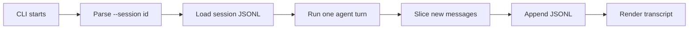

# Chapter 8: Persist Sessions as JSONL

## Where We Are

Chapter 7 gave the harness a useful read-only project capability. A normal prompt can now flow through:

```text
user -> assistant -> optional tool -> assistant
```

But every CLI run still starts from an empty array:

```ts
const conversation: Conversation = [];
```

That means the process forgets everything when it exits. A terminal coding harness needs memory across invocations, so this chapter adds the smallest durable session layer:

```text
.ty-term/
  sessions/
    lesson-8.jsonl
```

Each message is one JSON object on one line:

```jsonl
{"role":"user","content":"hello"}
{"role":"assistant","content":"agent heard: hello"}
```

## Learning Objective

Learn an append-only session log:



The invariant is:

> Load the previous conversation from disk, run one turn, then append only the messages created by that turn.

JSONL keeps this visible. You can inspect the session with `cat`, and appending does not require rewriting a full JSON array.

## Build The Slice

Change three files:

- `src/index.ts`
- `src/cli.ts`
- `tests/agent.test.ts`

No new dependencies are needed. This chapter uses Node’s standard library only.

## `src/index.ts`

Add `appendFile` and `mkdir` to the filesystem import:

```ts
import { appendFile, mkdir, readFile } from "node:fs/promises";
```

Add these session types near the other option interfaces:

```ts
export interface SessionTurnOptions {
  projectRoot?: string;
  sessionId: string;
  prompt: string;
  modelClient: ModelClient;
  toolRegistry: ToolRegistry;
}

export interface SessionTurnResult {
  previousConversation: Conversation;
  nextConversation: Conversation;
  appendedMessages: Conversation;
}
```

Then add the session helpers after `executeTool`:

```ts
export function validateSessionId(sessionId: string): string {
  if (!/^[A-Za-z0-9_-]+$/.test(sessionId)) {
    throw new Error(
      "Session id may contain only letters, numbers, dash, and underscore.",
    );
  }

  return sessionId;
}

export function getSessionFilePath(
  projectRoot: string,
  sessionId: string,
): string {
  const safeSessionId = validateSessionId(sessionId);

  return path.join(
    resolveProjectRoot(projectRoot),
    ".ty-term",
    "sessions",
    `${safeSessionId}.jsonl`,
  );
}

export async function loadSessionMessages(
  projectRoot: string,
  sessionId: string,
): Promise<Conversation> {
  const sessionFilePath = getSessionFilePath(projectRoot, sessionId);
  let contents: string;

  try {
    contents = await readFile(sessionFilePath, "utf8");
  } catch (error: unknown) {
    if (
      error &&
      typeof error === "object" &&
      "code" in error &&
      error.code === "ENOENT"
    ) {
      return [];
    }

    throw error;
  }

  return contents
    .split("\n")
    .filter((line) => line.length > 0)
    .map(parseSessionLine);
}

export async function appendSessionMessages(
  projectRoot: string,
  sessionId: string,
  messages: Conversation,
): Promise<void> {
  if (messages.length === 0) {
    validateSessionId(sessionId);
    return;
  }

  const sessionFilePath = getSessionFilePath(projectRoot, sessionId);
  await mkdir(path.dirname(sessionFilePath), { recursive: true });

  const lines = messages
    .map((message) => `${JSON.stringify(message)}\n`)
    .join("");

  await appendFile(sessionFilePath, lines, "utf8");
}

export async function runSessionTurn(
  options: SessionTurnOptions,
): Promise<SessionTurnResult> {
  const projectRoot = resolveProjectRoot(options.projectRoot);
  const previousConversation = await loadSessionMessages(
    projectRoot,
    options.sessionId,
  );
  const nextConversation = await runTurnWithTools(
    previousConversation,
    options.prompt,
    options.modelClient,
    options.toolRegistry,
  );
  const appendedMessages = nextConversation.slice(previousConversation.length);

  await appendSessionMessages(projectRoot, options.sessionId, appendedMessages);

  return {
    previousConversation,
    nextConversation,
    appendedMessages,
  };
}

function parseSessionLine(line: string): AgentMessage {
  const value: unknown = JSON.parse(line);

  if (!isAgentMessage(value)) {
    throw new Error("Session file contains an invalid message.");
  }

  return value;
}

function isAgentMessage(value: unknown): value is AgentMessage {
  if (!value || typeof value !== "object") {
    return false;
  }

  const message = value as Partial<Record<keyof AgentMessage, unknown>>;
  const validRole =
    message.role === "user" ||
    message.role === "assistant" ||
    message.role === "tool";
  const validContent = typeof message.content === "string";
  const validName =
    message.name === undefined || typeof message.name === "string";

  return validRole && validContent && validName;
}
```

## The Session Boundary

The session id becomes part of a filename, so it must not be a path:

```ts
export function validateSessionId(sessionId: string): string {
  if (!/^[A-Za-z0-9_-]+$/.test(sessionId)) {
    throw new Error(
      "Session id may contain only letters, numbers, dash, and underscore.",
    );
  }

  return sessionId;
}
```

This accepts:

```text
lesson-8
abc-123_DEF
```

It rejects:

```text
../escape
a/b
a.b
has space
```

The conservative rule is intentional. A session id is a name, not a path.

## The Append Trick

The chapter’s central line is:

```ts
const appendedMessages = nextConversation.slice(previousConversation.length);
```

The agent loop still receives a normal `Conversation`. Persistence does not leak into the loop. After the turn finishes, the storage layer appends only the new messages.

That means this existing history:

```ts
[
  { role: "user", content: "earlier" },
  { role: "assistant", content: "agent heard: earlier" },
];
```

followed by a new `hello` turn appends only:

```ts
[
  { role: "user", content: "hello" },
  { role: "assistant", content: "agent heard: hello" },
];
```

## `src/cli.ts`

Update the imports:

```ts
import {
  type Conversation,
  createBashTool,
  createCurrentDirectoryTool,
  createEchoModelClient,
  createOpenAIModelClient,
  createReadFileTool,
  createToolRegistry,
  executeTool,
  renderTranscript,
  resolveProjectRoot,
  runSessionTurn,
  runTurnWithTools,
  validateSessionId,
} from "./index";
```

Add `sessionId` to `ParsedArgs`:

```ts
interface ParsedArgs {
  useOpenAI: boolean;
  sessionId?: string;
  toolName?: string;
  toolInput?: string;
  prompt: string;
}
```

Update `parseArgs` to recognize `--session`:

```ts
function parseArgs(args: string[]): ParsedArgs {
  let useOpenAI = false;
  let sessionId: string | undefined;
  let toolName: string | undefined;
  let toolInput: string | undefined;
  const promptParts: string[] = [];

  for (let index = 0; index < args.length; index += 1) {
    const arg = args[index];

    if (arg === "--openai") {
      useOpenAI = true;
      continue;
    }

    if (arg === "--session") {
      const nextArg = args[index + 1];

      if (!nextArg || nextArg.startsWith("--")) {
        throw new Error("--session requires an id.");
      }

      sessionId = nextArg;
      index += 1;
      continue;
    }

    if (arg === "--tool") {
      toolName = args[index + 1];
      toolInput = args.slice(index + 2).join(" ");
      break;
    }

    promptParts.push(arg);
  }

  return {
    useOpenAI,
    sessionId,
    toolName,
    toolInput,
    prompt: promptParts.join(" "),
  };
}
```

Then replace `main` with:

```ts
async function main(): Promise<void> {
  const parsed = parseArgs(process.argv.slice(2));
  const projectRoot = resolveProjectRoot();

  if (parsed.sessionId !== undefined) {
    validateSessionId(parsed.sessionId);
  }

  if (parsed.toolName) {
    const registry = createToolRegistry([
      createCurrentDirectoryTool({ cwd: projectRoot }),
      createBashTool({ cwd: projectRoot }),
      createReadFileTool({ projectRoot }),
    ]);
    const result = await executeTool(
      registry,
      parsed.toolName,
      parsed.toolInput,
    );

    process.stdout.write(`tool ${parsed.toolName}:\n${result}\n`);
    return;
  }

  if (parsed.prompt.length === 0) {
    console.error(
      'Usage: bun run dev -- [--session id] [--openai] "your prompt"',
    );
    process.exit(1);
  }

  if (parsed.useOpenAI && !process.env.OPENAI_API_KEY) {
    console.error("OPENAI_API_KEY is required when using --openai.");
    process.exit(1);
  }

  const modelClient = parsed.useOpenAI
    ? createOpenAIModelClient()
    : createEchoModelClient();
  const modelToolRegistry = createToolRegistry([
    createCurrentDirectoryTool({ cwd: projectRoot }),
    createReadFileTool({ projectRoot }),
  ]);

  if (parsed.sessionId) {
    const result = await runSessionTurn({
      projectRoot,
      sessionId: parsed.sessionId,
      prompt: parsed.prompt,
      modelClient,
      toolRegistry: modelToolRegistry,
    });

    process.stdout.write(`${renderTranscript(result.nextConversation)}\n`);
    return;
  }

  const conversation: Conversation = [];
  const nextConversation = await runTurnWithTools(
    conversation,
    parsed.prompt,
    modelClient,
    modelToolRegistry,
  );

  process.stdout.write(`${renderTranscript(nextConversation)}\n`);
}
```

The no-session path still uses:

```ts
const conversation: Conversation = [];
```

Do not load a session with an empty id. Empty ids are invalid.

## `tests/agent.test.ts`

Add these imports:

```ts
import { mkdtemp, readFile, rm, writeFile } from "node:fs/promises";
```

and include the new exports:

```ts
import {
  type Conversation,
  appendSessionMessages,
  createBashTool,
  createCurrentDirectoryTool,
  createEchoModelClient,
  createReadFileTool,
  createToolMessage,
  createToolRegistry,
  executeCommand,
  executeTool,
  getSessionFilePath,
  getTool,
  loadSessionMessages,
  parseToolRequest,
  renderTranscript,
  runSessionTurn,
  runTurn,
  runTurnWithTools,
  validateSessionId,
} from "../src/index";
```

Add this test group:

```ts
describe("session persistence", () => {
  it("accepts conservative session ids", () => {
    expect(validateSessionId("abc-123_DEF")).toBe("abc-123_DEF");
  });

  it("rejects session ids that could alter the path", () => {
    for (const sessionId of ["", "../x", "a/b", "a.b", "has space"]) {
      expect(() => validateSessionId(sessionId)).toThrow(
        "Session id may contain only letters, numbers, dash, and underscore.",
      );
    }
  });

  it("stores sessions under the project root .ty-term directory", async () => {
    await withTempProject(async (projectRoot) => {
      expect(getSessionFilePath(projectRoot, "lesson-8")).toBe(
        path.join(projectRoot, ".ty-term", "sessions", "lesson-8.jsonl"),
      );
    });
  });

  it("returns an empty conversation when a session does not exist", async () => {
    await withTempProject(async (projectRoot) => {
      await expect(
        loadSessionMessages(projectRoot, "missing"),
      ).resolves.toEqual([]);
    });
  });

  it("appends and loads messages as JSONL", async () => {
    await withTempProject(async (projectRoot) => {
      await appendSessionMessages(projectRoot, "lesson-8", [
        { role: "user", content: "hello" },
        { role: "assistant", content: "agent heard: hello" },
      ]);

      await expect(
        loadSessionMessages(projectRoot, "lesson-8"),
      ).resolves.toEqual([
        { role: "user", content: "hello" },
        { role: "assistant", content: "agent heard: hello" },
      ]);

      await expect(
        readFile(getSessionFilePath(projectRoot, "lesson-8"), "utf8"),
      ).resolves.toBe(
        '{"role":"user","content":"hello"}\n{"role":"assistant","content":"agent heard: hello"}\n',
      );
    });
  });

  it("appends only the messages created during the current turn", async () => {
    await withTempProject(async (projectRoot) => {
      await appendSessionMessages(projectRoot, "lesson-8", [
        { role: "user", content: "earlier" },
        { role: "assistant", content: "agent heard: earlier" },
      ]);

      const result = await runSessionTurn({
        projectRoot,
        sessionId: "lesson-8",
        prompt: "hello",
        modelClient: createEchoModelClient(),
        toolRegistry: createToolRegistry([]),
      });

      expect(result.previousConversation).toHaveLength(2);
      expect(result.appendedMessages).toEqual([
        { role: "user", content: "hello" },
        { role: "assistant", content: "agent heard: hello" },
      ]);
      await expect(
        loadSessionMessages(projectRoot, "lesson-8"),
      ).resolves.toEqual([
        { role: "user", content: "earlier" },
        { role: "assistant", content: "agent heard: earlier" },
        { role: "user", content: "hello" },
        { role: "assistant", content: "agent heard: hello" },
      ]);
    });
  });

  it("rejects invalid message records while loading", async () => {
    await withTempProject(async (projectRoot) => {
      await appendSessionMessages(projectRoot, "broken", [
        { role: "user", content: "placeholder" },
      ]);
      await writeFile(
        getSessionFilePath(projectRoot, "broken"),
        '{"role":"user"}\n',
        "utf8",
      );

      await expect(loadSessionMessages(projectRoot, "broken")).rejects.toThrow(
        "Session file contains an invalid message.",
      );
    });
  });
});
```

One subtle case is multiline content. JSONL still stores it as one record because `JSON.stringify` escapes newline characters inside the JSON string:

```jsonl
{
  "role": "tool",
  "name": "read_file",
  "content": "line one\nline two\n"
}
```

That is still one physical line in the file.

## Run It

Run checks:

```bash
bun test
bun run build
```

Start a named session:

```bash
bun run dev -- --session lesson-8 "hello"
```

Expected shape:

```text
user: hello
assistant: agent heard: hello
```

Resume the same session:

```bash
bun run dev -- --session lesson-8 "read file package.json"
```

Expected shape:

```text
user: hello
assistant: agent heard: hello
user: read file package.json
assistant: TOOL read_file: package.json
tool read_file: {"name":"ty-term", ...}
assistant: saw tool read_file: {"name":"ty-term", ...}
```

Inspect the session file:

```bash
cat .ty-term/sessions/lesson-8.jsonl
```

It should contain one JSON object per message. After the two commands above, the file has six lines.

Try the safety boundary:

```bash
bun run dev -- --session ../bad "hello"
```

Expected error:

```text
Session id may contain only letters, numbers, dash, and underscore.
```

This should also fail because the flag has no id:

```bash
bun run dev -- --session --openai "hello"
```

Expected error:

```text
--session requires an id.
```

## Verification

The chapter implementation was checked in a scratch package:

```text
bun test: passed, 23 tests
bun run build: passed
CLI smoke: passed
```

The CLI smoke test confirmed:

- first `--session lesson-8 hello` creates a session
- second `--session lesson-8 "read file package.json"` loads and appends
- the session file ends with six JSONL lines
- `--session ../bad hello` rejects traversal
- `--session --openai hello` rejects the missing id

## Reference Pointer

In `pi-mono`, compare this chapter with:

- `pi-mono/packages/coding-agent/src/core/agent-session.ts`
- `pi-mono/packages/coding-agent/src/main.ts`
- `pi-mono/packages/coding-agent/src/cli/args.ts`

The real project has richer persistence: generated ids, session headers, metadata entries, compaction, branching, migrations, and event streams. This chapter keeps one idea: rebuild conversation state from an append-only message log.

## What We Simplified

We did not add generated session ids. The reader passes `--session lesson-8`.

We did not add locking. Two processes writing the same session can interleave.

We did not persist partial failed turns. If a tool throws, this chapter exits before appending.

We print the full resumed transcript so the persistence behavior is obvious. A later terminal UI would probably render a scrollback or only the latest turn.

## Checkpoint

You now have:

- `--session <id>` CLI parsing
- project-local session files under `.ty-term/sessions/`
- JSONL append-only message storage
- session loading before each run
- saving only messages created by the current run
- validation that prevents session ids from becoming paths
- tests around the persistence boundary

The harness now has durable memory. Chapter 9 uses that memory alongside project instructions, so the model can read local guidance before it answers.
