# Chapter 8: Persist Sessions as JSONL

Chapter 7 gave the harness a useful read-only project capability. A prompt can
now flow through the whole model-tool loop:

```text
user: read file package.json
assistant: TOOL read_file: package.json
tool read_file: {"name":"ty-term", ...}
assistant: saw tool read_file: {"name":"ty-term", ...}
```

The architecture at the end of Chapter 7 is intentionally split:

```text
Conversation stores and renders messages.
AgentMessageFactory creates user, assistant, and tool messages.
ToolRequestParser owns the text tool protocol.
ToolRegistry owns lookup and dispatch.
ReadFileTool owns project-root path safety.
AgentLoop orchestrates one turn.
cli.ts composes dependencies and prints output.
```

But every CLI run still starts with an empty `Conversation`:

```ts
const conversation = new Conversation();
```

That is fine for proving the tool loop. It is not enough for a terminal coding
harness. If the process forgets everything when it exits, the next command has
no history to send back to the model.

This chapter adds durable memory with an append-only JSONL session file:

```text
.ty-term/
  sessions/
    lesson-8.jsonl
```

Each line is one plain message record:

```jsonl
{"role":"user","content":"hello"}
{"role":"assistant","content":"agent heard: hello"}
```

The new boundary is not a pair of `loadSession()` and `saveSession()` helpers in
`src/index.ts`. Persistence deserves an owner:

```text
SessionStore describes the storage contract.
JsonlSessionStore implements that contract on disk.
```

## The Serialization Boundary

The code now has classes with behavior:

```text
Conversation can append and render messages.
AgentLoop can run one turn.
ToolRegistry can execute tools.
JsonlSessionStore can persist messages.
```

But JSON cannot store class behavior. JSONL stores data, not objects.

So the boundary is:

```text
In memory: Conversation class
On disk: plain AgentMessage records
```

That keeps persistence boring. The session file does not know how to render a
transcript, call a model, execute a tool, or run the agent loop. It only records
the messages needed to rebuild a `Conversation`.

The invariant for this chapter is:

```text
Load previous messages -> hydrate Conversation -> run one turn -> append only the new messages
```

In flow form:

```mermaid
flowchart LR
  CLI[CLI starts] --> Args[Parse --session id]
  Args --> Load[JsonlSessionStore.load]
  Load --> Conversation[Conversation.fromMessages]
  Conversation --> Turn[AgentLoop.runTurn]
  Turn --> Slice[conversation.messagesSince]
  Slice --> Append[JsonlSessionStore.append]
  Append --> Render[conversation.renderTranscript]
```



The storage layer owns loading and appending. `AgentLoop` still owns exactly one
agent turn.

## The File Layout

Add a session folder and evolve `Conversation` slightly:

```text
src/
  agent/
    agent-loop.ts
    agent-message.ts
    agent-message-factory.ts
    conversation.ts
  model/
    echo-model-client.ts
    model-client.ts
    openai-model-client.ts
  session/
    jsonl-session-store.ts
    session-store.ts
  tools/
    bash-tool.ts
    current-directory-tool.ts
    read-file-tool.ts
    tool.ts
    tool-registry.ts
    tool-request-parser.ts
  cli.ts
  index.ts
tests/
  session-store.test.ts
  session-resume.test.ts
```

`src/index.ts` remains a barrel file. It exports the new classes, but it does
not contain session behavior.

## Conversation Can Be Rebuilt

At the end of Chapter 7, `Conversation` already owns message storage and
transcript rendering. Persistence needs two more safe access points:

- Build a conversation from previously stored messages.
- Ask which messages were added after a known point.

Update `src/agent/conversation.ts`:

```ts
import type { AgentMessage } from "./agent-message";

export class Conversation {
  private readonly messages: AgentMessage[];

  constructor(messages: AgentMessage[] = []) {
    this.messages = [...messages];
  }

  static fromMessages(messages: AgentMessage[]): Conversation {
    return new Conversation(messages);
  }

  appendMessages(...messages: AgentMessage[]): void {
    this.messages.push(...messages);
  }

  get length(): number {
    return this.messages.length;
  }

  toMessages(): AgentMessage[] {
    return [...this.messages];
  }

  messagesSince(startIndex: number): AgentMessage[] {
    return this.messages.slice(startIndex);
  }

  renderTranscript(): string {
    return this.messages
      .map((message) => {
        if (message.role === "tool") {
          return `tool ${message.name}: ${message.content}`;
        }

        return `${message.role}: ${message.content}`;
      })
      .join("\n");
  }
}
```

The constructor copies the array it receives:

```ts
this.messages = [...messages];
```

That matters because callers should not be able to mutate a conversation by
holding onto the original array. The same rule appears in `toMessages()` and
`messagesSince()`. Both return copies.

`Conversation.fromMessages()` is deliberately small:

```ts
static fromMessages(messages: AgentMessage[]): Conversation {
  return new Conversation(messages);
}
```

The factory method is not doing magic yet. It names the hydration operation.
That name becomes useful at the session boundary:

```ts
const conversation = Conversation.fromMessages(
  await sessionStore.load(sessionId),
);
```

The session store loads plain records. `Conversation` turns those records back
into the object that owns behavior.

## The SessionStore Interface

Create `src/session/session-store.ts`:

```ts
import type { AgentMessage } from "../agent/agent-message";

export interface SessionStore {
  load(sessionId: string): Promise<AgentMessage[]>;
  append(sessionId: string, messages: AgentMessage[]): Promise<void>;
  getSessionFilePath(sessionId: string): string;
}
```

The interface talks in `AgentMessage[]`, not `Conversation`.

That is intentional. The store owns serialization. It does not own conversation
behavior.

If `SessionStore.load()` returned a `Conversation`, storage would begin deciding
which domain object to construct. That is tempting, but it couples disk I/O to
the agent domain. Keeping the interface in plain records makes the boundary
clean:

```text
JsonlSessionStore -> AgentMessage[]
Conversation.fromMessages -> Conversation
```

## The JsonlSessionStore

Create `src/session/jsonl-session-store.ts`:

```ts
import { appendFile, mkdir, readFile } from "node:fs/promises";
import path from "node:path";
import type { AgentMessage } from "../agent/agent-message";
import { resolveProjectRoot } from "../tools/read-file-tool";
import type { SessionStore } from "./session-store";

export class JsonlSessionStore implements SessionStore {
  private readonly sessionsDirectory: string;

  constructor(projectRoot = resolveProjectRoot()) {
    this.sessionsDirectory = path.join(
      resolveProjectRoot(projectRoot),
      ".ty-term",
      "sessions",
    );
  }

  getSessionFilePath(sessionId: string): string {
    return path.join(
      this.sessionsDirectory,
      `${validateSessionId(sessionId)}.jsonl`,
    );
  }

  async load(sessionId: string): Promise<AgentMessage[]> {
    const sessionFilePath = this.getSessionFilePath(sessionId);
    let contents: string;

    try {
      contents = await readFile(sessionFilePath, "utf8");
    } catch (error: unknown) {
      if (isNodeError(error) && error.code === "ENOENT") {
        return [];
      }

      throw error;
    }

    return contents
      .split("\n")
      .filter((line) => line.length > 0)
      .map(parseSessionLine);
  }

  async append(sessionId: string, messages: AgentMessage[]): Promise<void> {
    validateSessionId(sessionId);

    if (messages.length === 0) {
      return;
    }

    const sessionFilePath = this.getSessionFilePath(sessionId);
    await mkdir(path.dirname(sessionFilePath), { recursive: true });

    const lines = messages
      .map((message) => `${JSON.stringify(message)}\n`)
      .join("");

    await appendFile(sessionFilePath, lines, "utf8");
  }
}

export function validateSessionId(sessionId: string): string {
  if (!/^[A-Za-z0-9_-]+$/.test(sessionId)) {
    throw new Error(
      "Session id may contain only letters, numbers, dash, and underscore.",
    );
  }

  return sessionId;
}

function parseSessionLine(line: string): AgentMessage {
  const value: unknown = JSON.parse(line);

  if (!isAgentMessage(value)) {
    throw new Error("Session file contains an invalid message.");
  }

  return value;
}

function isAgentMessage(value: unknown): value is AgentMessage {
  if (!value || typeof value !== "object") {
    return false;
  }

  const message = value as Partial<Record<keyof AgentMessage, unknown>>;
  const validRole =
    message.role === "user" ||
    message.role === "assistant" ||
    message.role === "tool";
  const validContent = typeof message.content === "string";
  const validName =
    message.name === undefined || typeof message.name === "string";

  return validRole && validContent && validName;
}

function isNodeError(error: unknown): error is NodeJS.ErrnoException {
  return error instanceof Error && "code" in error;
}
```

There are three decisions in this class.

First, the session id is not a path:

```ts
export function validateSessionId(sessionId: string): string {
  if (!/^[A-Za-z0-9_-]+$/.test(sessionId)) {
    throw new Error(
      "Session id may contain only letters, numbers, dash, and underscore.",
    );
  }

  return sessionId;
}
```

This accepts names like:

```text
lesson-8
abc-123_DEF
```

It rejects names like:

```text
../escape
a/b
a.b
has space
```

The conservative rule is the point. A session id is a name inside
`.ty-term/sessions/`, not a filesystem path.

Second, missing sessions load as empty history:

```ts
if (isNodeError(error) && error.code === "ENOENT") {
  return [];
}
```

That lets the CLI use the same flow for a new session and an existing session.

Third, `append()` writes only the records it receives:

```ts
const lines = messages
  .map((message) => `${JSON.stringify(message)}\n`)
  .join("");
```

It does not rewrite the whole session. JSONL is useful here because appending
new records is the natural operation.

Multiline message content is still safe. `JSON.stringify()` escapes newline
characters inside the JSON string, so this message:

```ts
{
  role: "tool",
  name: "read_file",
  content: "line one\nline two\n",
}
```

is stored as one physical JSONL line.

## The Barrel File Exports Storage

Update `src/index.ts` so it stays a barrel:

```ts
export { AgentLoop } from "./agent/agent-loop";
export type { AgentMessage, AgentRole } from "./agent/agent-message";
export { AgentMessageFactory } from "./agent/agent-message-factory";
export { Conversation } from "./agent/conversation";
export { EchoModelClient } from "./model/echo-model-client";
export type { ModelClient } from "./model/model-client";
export { OpenAIModelClient } from "./model/openai-model-client";
export {
  JsonlSessionStore,
  validateSessionId,
} from "./session/jsonl-session-store";
export type { SessionStore } from "./session/session-store";
export {
  BashTool,
  formatCommandResult,
  runShellCommand,
  type CommandOptions,
  type CommandResult,
  type CommandRunner,
} from "./tools/bash-tool";
export { CurrentDirectoryTool } from "./tools/current-directory-tool";
export {
  ReadFileTool,
  resolveProjectFilePath,
  resolveProjectRoot,
} from "./tools/read-file-tool";
export type { Tool } from "./tools/tool";
export { ToolRegistry } from "./tools/tool-registry";
export { ToolRequestParser, type ToolRequest } from "./tools/tool-request-parser";
```

This file still should not contain `loadSessionMessages()`,
`appendSessionMessages()`, or `runSessionTurn()`. The first two belong to
`JsonlSessionStore`. The third is not a domain concept; it is CLI composition.

## The CLI Composes Persistence

The CLI now has one more dependency to compose:

```text
JsonlSessionStore
```

It may load a conversation before `AgentLoop.runTurn()` and append messages
afterward. That is process wiring. It is not agent behavior.

Update `src/cli.ts`:

```ts
#!/usr/bin/env bun

import {
  AgentLoop,
  AgentMessageFactory,
  BashTool,
  Conversation,
  CurrentDirectoryTool,
  EchoModelClient,
  JsonlSessionStore,
  OpenAIModelClient,
  ReadFileTool,
  ToolRegistry,
  resolveProjectRoot,
  validateSessionId,
} from "./index";

interface ParsedArgs {
  readonly useOpenAI: boolean;
  readonly sessionId?: string;
  readonly toolName?: string;
  readonly toolInput?: string;
  readonly prompt: string;
}

function parseArgs(args: string[]): ParsedArgs {
  let useOpenAI = false;
  let sessionId: string | undefined;
  let toolName: string | undefined;
  let toolInput: string | undefined;
  const promptParts: string[] = [];

  for (let index = 0; index < args.length; index += 1) {
    const arg = args[index];

    if (arg === "--openai") {
      useOpenAI = true;
      continue;
    }

    if (arg === "--session") {
      const nextArg = args[index + 1];

      if (!nextArg || nextArg.startsWith("--")) {
        throw new Error("--session requires an id.");
      }

      sessionId = nextArg;
      index += 1;
      continue;
    }

    if (arg === "--tool") {
      toolName = args[index + 1];
      toolInput = args.slice(index + 2).join(" ");
      break;
    }

    promptParts.push(arg);
  }

  return {
    useOpenAI,
    sessionId,
    toolName,
    toolInput,
    prompt: promptParts.join(" "),
  };
}

async function main(): Promise<void> {
  const parsed = parseArgs(process.argv.slice(2));
  const projectRoot = resolveProjectRoot();

  if (parsed.sessionId !== undefined) {
    validateSessionId(parsed.sessionId);
  }

  if (parsed.toolName) {
    const manualToolRegistry = new ToolRegistry([
      new CurrentDirectoryTool(projectRoot),
      new BashTool({ cwd: projectRoot }),
      new ReadFileTool(projectRoot),
    ]);

    const result = await manualToolRegistry.execute(
      parsed.toolName,
      parsed.toolInput,
    );

    process.stdout.write(`tool ${parsed.toolName}:\n${result}\n`);
    return;
  }

  if (parsed.prompt.length === 0) {
    console.error(
      'Usage: bun run dev -- [--session id] [--openai] "your prompt"',
    );
    console.error("       bun run dev -- --tool cwd");
    console.error('       bun run dev -- --tool bash "pwd"');
    console.error("       bun run dev -- --tool read_file package.json");
    process.exit(1);
  }

  if (parsed.useOpenAI && !process.env.OPENAI_API_KEY) {
    console.error("OPENAI_API_KEY is required when using --openai.");
    process.exit(1);
  }

  const messageFactory = new AgentMessageFactory();
  const modelClient = parsed.useOpenAI
    ? new OpenAIModelClient()
    : new EchoModelClient();
  const modelToolRegistry = new ToolRegistry([
    new CurrentDirectoryTool(projectRoot),
    new ReadFileTool(projectRoot),
  ]);
  const agentLoop = new AgentLoop(
    messageFactory,
    modelClient,
    modelToolRegistry,
  );
  const sessionStore = new JsonlSessionStore(projectRoot);
  const conversation = parsed.sessionId
    ? Conversation.fromMessages(await sessionStore.load(parsed.sessionId))
    : new Conversation();
  const startingLength = conversation.length;

  await agentLoop.runTurn(conversation, parsed.prompt);

  if (parsed.sessionId) {
    await sessionStore.append(
      parsed.sessionId,
      conversation.messagesSince(startingLength),
    );
  }

  process.stdout.write(`${conversation.renderTranscript()}\n`);
}

main().catch((error: unknown) => {
  const message = error instanceof Error ? error.message : String(error);
  process.stderr.write(`${message}\n`);
  process.exitCode = 1;
});
```

The important sequence is small:

```ts
const conversation = parsed.sessionId
  ? Conversation.fromMessages(await sessionStore.load(parsed.sessionId))
  : new Conversation();
const startingLength = conversation.length;

await agentLoop.runTurn(conversation, parsed.prompt);

if (parsed.sessionId) {
  await sessionStore.append(
    parsed.sessionId,
    conversation.messagesSince(startingLength),
  );
}
```

`AgentLoop` does not know whether this conversation came from disk or from a new
constructor call. It receives a `Conversation` and runs one turn.

The CLI does know about process concerns:

- `process.argv`
- `process.env.OPENAI_API_KEY`
- project root selection
- dependency construction
- stdout and stderr
- whether a session flag was provided

That is enough responsibility. Do not move JSON parsing, transcript rendering,
tool execution, or model orchestration into the CLI.

## Tests For Session Storage

Start with the persistence boundary itself.

Create `tests/session-store.test.ts`:

```ts
import { mkdtemp, readFile, rm, writeFile } from "node:fs/promises";
import { tmpdir } from "node:os";
import path from "node:path";
import { describe, expect, it } from "bun:test";
import { JsonlSessionStore, validateSessionId } from "../src/index";

async function withTempProject<T>(
  callback: (projectRoot: string) => Promise<T>,
): Promise<T> {
  const projectRoot = await mkdtemp(path.join(tmpdir(), "ty-term-session-"));

  try {
    return await callback(projectRoot);
  } finally {
    await rm(projectRoot, { recursive: true, force: true });
  }
}

describe("JsonlSessionStore", () => {
  it("accepts conservative session ids", () => {
    expect(validateSessionId("abc-123_DEF")).toBe("abc-123_DEF");
  });

  it("rejects session ids that could alter the path", () => {
    for (const sessionId of ["", "../x", "a/b", "a.b", "has space"]) {
      expect(() => validateSessionId(sessionId)).toThrow(
        "Session id may contain only letters, numbers, dash, and underscore.",
      );
    }
  });

  it("stores sessions under the project root .ty-term directory", async () => {
    await withTempProject(async (projectRoot) => {
      const store = new JsonlSessionStore(projectRoot);

      expect(store.getSessionFilePath("lesson-8")).toBe(
        path.join(projectRoot, ".ty-term", "sessions", "lesson-8.jsonl"),
      );
    });
  });

  it("returns an empty history when a session does not exist", async () => {
    await withTempProject(async (projectRoot) => {
      const store = new JsonlSessionStore(projectRoot);

      await expect(store.load("missing")).resolves.toEqual([]);
    });
  });

  it("appends and loads messages as JSONL", async () => {
    await withTempProject(async (projectRoot) => {
      const store = new JsonlSessionStore(projectRoot);

      await store.append("lesson-8", [
        { role: "user", content: "hello" },
        { role: "assistant", content: "agent heard: hello" },
      ]);

      await expect(store.load("lesson-8")).resolves.toEqual([
        { role: "user", content: "hello" },
        { role: "assistant", content: "agent heard: hello" },
      ]);

      await expect(
        readFile(store.getSessionFilePath("lesson-8"), "utf8"),
      ).resolves.toBe(
        '{"role":"user","content":"hello"}\n{"role":"assistant","content":"agent heard: hello"}\n',
      );
    });
  });

  it("rejects invalid message records while loading", async () => {
    await withTempProject(async (projectRoot) => {
      const store = new JsonlSessionStore(projectRoot);
      await store.append("broken", [{ role: "user", content: "placeholder" }]);
      await writeFile(
        store.getSessionFilePath("broken"),
        '{"role":"user"}\n',
        "utf8",
      );

      await expect(store.load("broken")).rejects.toThrow(
        "Session file contains an invalid message.",
      );
    });
  });
});
```

These tests do not instantiate `AgentLoop`. That is the point. They test the
storage object as a storage object:

```text
session id validation
path resolution
missing session loading
JSONL append
JSONL hydration
invalid record rejection
```

## Tests For Resuming A Conversation

The next test proves the composition rule:

```text
load old messages, run one turn, append only new messages
```

Create `tests/session-resume.test.ts`:

```ts
import { mkdtemp, rm } from "node:fs/promises";
import { tmpdir } from "node:os";
import path from "node:path";
import { describe, expect, it } from "bun:test";
import {
  AgentLoop,
  AgentMessageFactory,
  Conversation,
  EchoModelClient,
  JsonlSessionStore,
  ToolRegistry,
} from "../src/index";

async function withTempProject<T>(
  callback: (projectRoot: string) => Promise<T>,
): Promise<T> {
  const projectRoot = await mkdtemp(path.join(tmpdir(), "ty-term-resume-"));

  try {
    return await callback(projectRoot);
  } finally {
    await rm(projectRoot, { recursive: true, force: true });
  }
}

describe("session resume", () => {
  it("hydrates a conversation and appends only the current turn", async () => {
    await withTempProject(async (projectRoot) => {
      const sessionStore = new JsonlSessionStore(projectRoot);
      await sessionStore.append("lesson-8", [
        { role: "user", content: "earlier" },
        { role: "assistant", content: "agent heard: earlier" },
      ]);

      const conversation = Conversation.fromMessages(
        await sessionStore.load("lesson-8"),
      );
      const startingLength = conversation.length;
      const agentLoop = new AgentLoop(
        new AgentMessageFactory(),
        new EchoModelClient(),
        new ToolRegistry([]),
      );

      await agentLoop.runTurn(conversation, "hello");

      const appendedMessages = conversation.messagesSince(startingLength);
      await sessionStore.append("lesson-8", appendedMessages);

      expect(appendedMessages).toEqual([
        { role: "user", content: "hello" },
        { role: "assistant", content: "agent heard: hello" },
      ]);
      await expect(sessionStore.load("lesson-8")).resolves.toEqual([
        { role: "user", content: "earlier" },
        { role: "assistant", content: "agent heard: earlier" },
        { role: "user", content: "hello" },
        { role: "assistant", content: "agent heard: hello" },
      ]);
    });
  });
});
```

This test deliberately performs the same composition the CLI performs. There is
no `runSessionTurn()` helper to hide the data flow.

The lesson is the data flow:

```ts
const conversation = Conversation.fromMessages(
  await sessionStore.load("lesson-8"),
);
const startingLength = conversation.length;

await agentLoop.runTurn(conversation, "hello");

await sessionStore.append(
  "lesson-8",
  conversation.messagesSince(startingLength),
);
```

If this feels a little repetitive between the CLI and the test, that is
acceptable at this point in the book. A later `InteractiveLoop` can own repeated
terminal behavior. This chapter should not invent a session god object just to
remove four lines from the CLI.

## Run It

Run the usual checks:

```bash
bun test
bun run build
```

Start a named session:

```bash
bun run dev -- --session lesson-8 "hello"
```

Expected shape:

```text
user: hello
assistant: agent heard: hello
```

Resume the same session:

```bash
bun run dev -- --session lesson-8 "read file package.json"
```

Expected shape:

```text
user: hello
assistant: agent heard: hello
user: read file package.json
assistant: TOOL read_file: package.json
tool read_file: {"name":"ty-term", ...}
assistant: saw tool read_file: {"name":"ty-term", ...}
```

Inspect the file:

```bash
cat .ty-term/sessions/lesson-8.jsonl
```

After those two commands, it should contain one JSON object per message.

Try the session-id safety boundary:

```bash
bun run dev -- --session ../bad "hello"
```

Expected error:

```text
Session id may contain only letters, numbers, dash, and underscore.
```

This should also fail because the flag has no id:

```bash
bun run dev -- --session --openai "hello"
```

Expected error:

```text
--session requires an id.
```

## What We Simplified

We did not add generated session ids. The reader passes `--session lesson-8`.

We did not add locking. Two processes writing the same session can interleave.

We did not persist partial failed turns. If a model call or tool throws, this
chapter exits before appending.

We print the full resumed transcript so the persistence behavior is visible. A
later terminal UI would probably render only the latest turn or a scrollback
window.

We kept session composition in `cli.ts` for now. That is acceptable because
there is only one process mode. Chapter 10 will introduce `InteractiveLoop`,
which is a better owner for repeated terminal behavior.

## Checkpoint

You now have:

- `--session <id>` CLI parsing
- `SessionStore` as the storage contract
- `JsonlSessionStore` as the disk implementation
- project-local session files under `.ty-term/sessions/`
- JSONL append-only message storage
- `Conversation.fromMessages()` for hydration
- safe message access through `toMessages()` and `messagesSince()`
- saving only messages created by the current run
- validation that prevents session ids from becoming paths
- tests around storage and resume behavior

The harness now has durable memory. Chapter 9 uses that memory alongside
project instructions, so the model can read local guidance before it answers.
