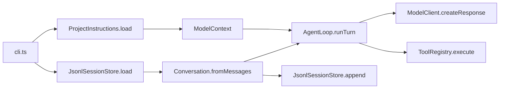

# Chapter 9: Load Project Instructions

Chapter 8 gave `ty-term` durable memory:

```text
CLI starts -> load previous messages -> hydrate Conversation -> run one turn -> append new messages
```

That is the right shape for session history. The harness can remember what the
user said, what the assistant answered, and what tools returned.

But a coding harness also needs project-specific guidance. Repositories often
have rules that are not part of any one conversation:

```text
Use small patches.
Run bun test before reporting completion.
Do not edit generated files.
Prefer the existing OOP boundaries.
```

Those rules should affect model calls, but they should not become conversation
messages. If we append `AGENTS.md` to every JSONL session, the session history
becomes polluted with context that can change independently of the conversation.

This chapter adds two named boundaries:

```text
ProjectInstructions owns locating, loading, and formatting local guidance.
ModelContext owns the model-facing context passed into ModelClient.
```

The invariant for this chapter is:

```text
Project instructions are model context, not session history.
```

## Where This Fits

At the end of Chapter 8, the main objects were already separated:

```text
Conversation stores and renders messages.
AgentMessageFactory creates user, assistant, and tool messages.
ToolRegistry owns lookup and dispatch.
ReadFileTool owns project-root path safety.
JsonlSessionStore persists plain AgentMessage records.
AgentLoop orchestrates one turn.
cli.ts composes dependencies and prints output.
```

Chapter 9 keeps that split. The new project-instruction behavior does not
belong in `Conversation`, because instructions are not messages. It does not
belong in `JsonlSessionStore`, because the session store should persist only
conversation records. It does not belong in `OpenAIModelClient`, because a model
provider should receive context, not know how to find files in the current
project.

So the flow becomes:



The CLI is still the composition root. It wires objects together. It does not
format instructions itself.

## The File Layout

Add one project object and one model context object:

```text
src/
  agent/
    AgentLoop.ts
    AgentMessage.ts
    AgentMessageFactory.ts
    Conversation.ts
  model/
    EchoModelClient.ts
    ModelClient.ts
    ModelContext.ts
    OpenAIModelClient.ts
  project/
    ProjectInstructions.ts
  session/
    JsonlSessionStore.ts
    SessionStore.ts
  tools/
    BashTool.ts
    CurrentDirectoryTool.ts
    ReadFileTool.ts
    Tool.ts
    ToolRegistry.ts
    ToolRequestParser.ts
  cli.ts
  index.ts
tests/
  project-instructions.test.ts
  model-context.test.ts
```

`src/index.ts` remains a barrel file. It exports the new classes and types, but
it does not contain project-loading behavior.

## ModelContext Is The Model-Facing Envelope

Create `src/model/ModelContext.ts`:

```ts
export class ModelContext {
  readonly projectInstructions: string;

  constructor(options: { projectInstructions?: string } = {}) {
    this.projectInstructions = options.projectInstructions ?? "";
  }

  hasProjectInstructions(): boolean {
    return this.projectInstructions.length > 0;
  }
}
```

This class is intentionally small. It gives a name to information that is sent
to the model but is not part of the transcript:

```text
Conversation -> user, assistant, and tool history
ModelContext -> extra model-facing context
```

Right now `ModelContext` has one field. Later it could carry date, working
directory, enabled tool descriptions, feature flags, or skill summaries. The
important part is that the provider receives a prepared context object. The
provider does not discover that context by reading project files.

Update `src/model/ModelClient.ts`:

```ts
import type { Conversation } from "../agent/Conversation";
import type { ModelContext } from "./ModelContext";

export interface ModelClient {
  createResponse(
    prompt: string,
    conversation: Conversation,
    context: ModelContext,
  ): Promise<string>;
}
```

Every model call now gets the same three inputs:

```text
the current prompt
the conversation so far
the model context for this run
```

That keeps the call site honest. If `AgentLoop` calls the model twice during a
tool turn, both calls must receive the same `ModelContext`.

## EchoModelClient Accepts Context Without Using It

The echo client is still a deterministic test double. It does not need project
instructions, but it should implement the same interface as real providers.

Update `src/model/EchoModelClient.ts`:

```ts
import type { Conversation } from "../agent/Conversation";
import type { ModelClient } from "./ModelClient";
import type { ModelContext } from "./ModelContext";

export class EchoModelClient implements ModelClient {
  async createResponse(
    prompt: string,
    _conversation: Conversation,
    _context: ModelContext,
  ): Promise<string> {
    if (prompt.length === 0) {
      return "done";
    }

    if (prompt.includes("where") && prompt.includes("I")) {
      return "TOOL cwd";
    }

    if (prompt.startsWith("read file ")) {
      return `TOOL read_file: ${prompt.slice("read file ".length)}`;
    }

    return `agent heard: ${prompt}`;
  }
}
```

The underscores are not throwaway architecture. They tell the reader this class
conforms to the same model boundary, even though this implementation does not
need every argument.

## ProjectInstructions Owns Local Guidance

Create `src/project/ProjectInstructions.ts`:

```ts
import { readFile } from "node:fs/promises";
import path from "node:path";
import { ModelContext } from "../model/ModelContext";
import { resolveProjectRoot } from "../tools/ReadFileTool";

export class ProjectInstructions {
  private readonly projectRoot: string;
  private readonly fileName: string;
  private readonly content: string;

  private constructor(options: {
    projectRoot: string;
    fileName: string;
    content: string;
  }) {
    this.projectRoot = options.projectRoot;
    this.fileName = options.fileName;
    this.content = options.content;
  }

  static async load(
    projectRoot = resolveProjectRoot(),
    fileName = "AGENTS.md",
  ): Promise<ProjectInstructions> {
    const resolvedRoot = resolveProjectRoot(projectRoot);
    const filePath = path.join(resolvedRoot, fileName);

    try {
      const content = await readFile(filePath, "utf8");

      return new ProjectInstructions({
        projectRoot: resolvedRoot,
        fileName,
        content,
      });
    } catch (error: unknown) {
      if (isNodeError(error) && error.code === "ENOENT") {
        return new ProjectInstructions({
          projectRoot: resolvedRoot,
          fileName,
          content: "",
        });
      }

      throw error;
    }
  }

  get filePath(): string {
    return path.join(this.projectRoot, this.fileName);
  }

  get text(): string {
    return this.content;
  }

  toModelContext(): ModelContext {
    return new ModelContext({
      projectInstructions: this.formatForModel(),
    });
  }

  private formatForModel(): string {
    return this.content.trimEnd();
  }
}

function isNodeError(error: unknown): error is NodeJS.ErrnoException {
  return error instanceof Error && "code" in error;
}
```

This object has three jobs:

```text
locate AGENTS.md
load its contents if it exists
format that text for ModelContext
```

It also has clear refusals:

```text
It does not append messages.
It does not call the model.
It does not execute tools.
It does not decide how OpenAI structures prompts.
```

Only a missing `AGENTS.md` becomes empty instructions:

```ts
if (isNodeError(error) && error.code === "ENOENT") {
  return new ProjectInstructions({
    projectRoot: resolvedRoot,
    fileName,
    content: "",
  });
}
```

Other filesystem errors still fail. If `AGENTS.md` exists but cannot be read,
the harness should not silently run with missing guidance.

The formatting method trims only trailing whitespace:

```ts
private formatForModel(): string {
  return this.content.trimEnd();
}
```

That keeps the author's text intact while avoiding a dangling blank block in
provider instructions.

## OpenAIModelClient Uses Context, Not Files

The provider class should not know about `AGENTS.md`. It should know how to
convert a `Conversation` and a `ModelContext` into an OpenAI request.

Update `src/model/OpenAIModelClient.ts`:

```ts
import OpenAI from "openai";
import type { Conversation } from "../agent/Conversation";
import type { ModelClient } from "./ModelClient";
import type { ModelContext } from "./ModelContext";

export interface OpenAIResponsesClient {
  responses: {
    create(options: {
      model: string;
      instructions: string;
      input: string;
    }): Promise<{ output_text: string }>;
  };
}

export class OpenAIModelClient implements ModelClient {
  private readonly model: string;
  private readonly client: OpenAIResponsesClient;

  constructor(
    model = process.env.OPENAI_MODEL ?? "gpt-4.1-mini",
    client: OpenAIResponsesClient = new OpenAI(),
  ) {
    this.model = model;
    this.client = client;
  }

  async createResponse(
    prompt: string,
    conversation: Conversation,
    context: ModelContext,
  ): Promise<string> {
    const response = await this.client.responses.create({
      model: this.model,
      instructions: buildModelInstructions(context),
      input: [conversation.renderTranscript(), prompt]
        .filter((part) => part.length > 0)
        .join("\n"),
    });

    return response.output_text;
  }
}

export function buildModelInstructions(context: ModelContext): string {
  const baseInstructions = [
    "You are connected to a tiny learning harness.",
    "If you need the current working directory, respond exactly: TOOL cwd",
    "If you need to read a project file, respond exactly: TOOL read_file: relative/path.txt",
    "Only request relative project file paths.",
    "Do not request bash commands.",
    "After a tool result appears, answer the user in normal text.",
  ].join("\n");

  if (!context.hasProjectInstructions()) {
    return baseInstructions;
  }

  return [
    baseInstructions,
    "",
    "Project instructions from AGENTS.md:",
    context.projectInstructions,
  ].join("\n");
}
```

The base instructions still contain the harness rules. Project instructions are
appended below them:

```text
base tool protocol

Project instructions from AGENTS.md:
...
```

That ordering matters. A project file can add local guidance, but it should not
replace the harness's tool protocol.

Notice what is missing from this class:

```text
No path.join(...)
No readFile(...)
No resolveProjectRoot(...)
No AGENTS.md lookup
```

Those details belong to `ProjectInstructions`.

## AgentLoop Carries Context Through The Turn

Chapter 8 kept `AgentLoop` focused on one turn. That remains true. It now
accepts a `ModelContext` for the turn and passes that context to every model
call.

Update `src/agent/AgentLoop.ts`:

```ts
import type { ModelClient } from "../model/ModelClient";
import { ModelContext } from "../model/ModelContext";
import type { ToolRegistry } from "../tools/ToolRegistry";
import { ToolRequestParser } from "../tools/ToolRequestParser";
import type { AgentMessageFactory } from "./AgentMessageFactory";
import type { Conversation } from "./Conversation";

export class AgentLoop {
  private readonly messageFactory: AgentMessageFactory;
  private readonly modelClient: ModelClient;
  private readonly toolRegistry: ToolRegistry;
  private readonly toolRequestParser: ToolRequestParser;

  constructor(
    messageFactory: AgentMessageFactory,
    modelClient: ModelClient,
    toolRegistry: ToolRegistry,
    toolRequestParser = new ToolRequestParser(),
  ) {
    this.messageFactory = messageFactory;
    this.modelClient = modelClient;
    this.toolRegistry = toolRegistry;
    this.toolRequestParser = toolRequestParser;
  }

  async runTurn(
    conversation: Conversation,
    prompt: string,
    context = new ModelContext(),
  ): Promise<void> {
    conversation.appendMessages(this.messageFactory.createUserMessage(prompt));

    const assistantContent = await this.modelClient.createResponse(
      prompt,
      conversation,
      context,
    );
    conversation.appendMessages(
      this.messageFactory.createAssistantMessage(assistantContent),
    );

    const toolRequest = this.toolRequestParser.parse(assistantContent);

    if (!toolRequest) {
      return;
    }

    const toolResult = await this.toolRegistry.execute(
      toolRequest.name,
      toolRequest.input,
    );
    conversation.appendMessages(
      this.messageFactory.createToolMessage(toolRequest.name, toolResult),
    );

    const finalAssistantContent = await this.modelClient.createResponse(
      "",
      conversation,
      context,
    );
    conversation.appendMessages(
      this.messageFactory.createAssistantMessage(finalAssistantContent),
    );
  }
}
```

`AgentLoop` does not load project files:

```text
No readFile
No AGENTS.md
No ProjectInstructions.load()
```

It receives `ModelContext` from the composition root and carries it through the
turn. That is orchestration. File discovery stays outside the agent loop.

## The Barrel File Exports Context

Update `src/index.ts`:

```ts
export { AgentLoop } from "./agent/AgentLoop";
export type { AgentMessage, AgentRole } from "./agent/AgentMessage";
export { AgentMessageFactory } from "./agent/AgentMessageFactory";
export { Conversation } from "./agent/Conversation";
export { EchoModelClient } from "./model/EchoModelClient";
export type { ModelClient } from "./model/ModelClient";
export { ModelContext } from "./model/ModelContext";
export {
  OpenAIModelClient,
  buildModelInstructions,
  type OpenAIResponsesClient,
} from "./model/OpenAIModelClient";
export { ProjectInstructions } from "./project/ProjectInstructions";
export {
  JsonlSessionStore,
  validateSessionId,
} from "./session/JsonlSessionStore";
export type { SessionStore } from "./session/SessionStore";
export {
  BashTool,
  formatCommandResult,
  runShellCommand,
  type CommandOptions,
  type CommandResult,
  type CommandRunner,
} from "./tools/BashTool";
export { CurrentDirectoryTool } from "./tools/CurrentDirectoryTool";
export {
  ReadFileTool,
  resolveProjectFilePath,
  resolveProjectRoot,
} from "./tools/ReadFileTool";
export type { Tool } from "./tools/Tool";
export { ToolRegistry } from "./tools/ToolRegistry";
export { ToolRequestParser, type ToolRequest } from "./tools/ToolRequestParser";
```

The barrel exports names. It still does not implement behavior.

## The CLI Composes Project Context

`cli.ts` now composes one more object:

```text
ProjectInstructions
```

Manual tool mode still returns before project instructions are loaded. Manual
tool mode does not call the model, so it does not need model context.

Update `src/cli.ts`:

```ts
#!/usr/bin/env bun

import {
  AgentLoop,
  AgentMessageFactory,
  BashTool,
  Conversation,
  CurrentDirectoryTool,
  EchoModelClient,
  JsonlSessionStore,
  OpenAIModelClient,
  ProjectInstructions,
  ReadFileTool,
  ToolRegistry,
  resolveProjectRoot,
  validateSessionId,
} from "./index";

interface ParsedArgs {
  readonly useOpenAI: boolean;
  readonly sessionId?: string;
  readonly toolName?: string;
  readonly toolInput?: string;
  readonly prompt: string;
}

function parseArgs(args: string[]): ParsedArgs {
  let useOpenAI = false;
  let sessionId: string | undefined;
  let toolName: string | undefined;
  let toolInput: string | undefined;
  const promptParts: string[] = [];

  for (let index = 0; index < args.length; index += 1) {
    const arg = args[index];

    if (arg === "--openai") {
      useOpenAI = true;
      continue;
    }

    if (arg === "--session") {
      const nextArg = args[index + 1];

      if (!nextArg || nextArg.startsWith("--")) {
        throw new Error("--session requires an id.");
      }

      sessionId = nextArg;
      index += 1;
      continue;
    }

    if (arg === "--tool") {
      toolName = args[index + 1];
      toolInput = args.slice(index + 2).join(" ");
      break;
    }

    promptParts.push(arg);
  }

  return {
    useOpenAI,
    sessionId,
    toolName,
    toolInput,
    prompt: promptParts.join(" "),
  };
}

async function main(): Promise<void> {
  const parsed = parseArgs(process.argv.slice(2));
  const projectRoot = resolveProjectRoot();

  if (parsed.sessionId !== undefined) {
    validateSessionId(parsed.sessionId);
  }

  if (parsed.toolName) {
    const manualToolRegistry = new ToolRegistry([
      new CurrentDirectoryTool(projectRoot),
      new BashTool({ cwd: projectRoot }),
      new ReadFileTool(projectRoot),
    ]);

    const result = await manualToolRegistry.execute(
      parsed.toolName,
      parsed.toolInput,
    );

    process.stdout.write(`tool ${parsed.toolName}:\n${result}\n`);
    return;
  }

  if (parsed.prompt.length === 0) {
    console.error(
      'Usage: bun run dev -- [--session id] [--openai] "your prompt"',
    );
    console.error("       bun run dev -- --tool cwd");
    console.error('       bun run dev -- --tool bash "pwd"');
    console.error("       bun run dev -- --tool read_file package.json");
    process.exit(1);
  }

  if (parsed.useOpenAI && !process.env.OPENAI_API_KEY) {
    console.error("OPENAI_API_KEY is required when using --openai.");
    process.exit(1);
  }

  const projectInstructions = await ProjectInstructions.load(projectRoot);
  const modelContext = projectInstructions.toModelContext();
  const messageFactory = new AgentMessageFactory();
  const modelClient = parsed.useOpenAI
    ? new OpenAIModelClient()
    : new EchoModelClient();
  const modelToolRegistry = new ToolRegistry([
    new CurrentDirectoryTool(projectRoot),
    new ReadFileTool(projectRoot),
  ]);
  const agentLoop = new AgentLoop(
    messageFactory,
    modelClient,
    modelToolRegistry,
  );
  const sessionStore = new JsonlSessionStore(projectRoot);
  const conversation = parsed.sessionId
    ? Conversation.fromMessages(await sessionStore.load(parsed.sessionId))
    : new Conversation();
  const startingLength = conversation.length;

  await agentLoop.runTurn(conversation, parsed.prompt, modelContext);

  if (parsed.sessionId) {
    await sessionStore.append(
      parsed.sessionId,
      conversation.messagesSince(startingLength),
    );
  }

  process.stdout.write(`${conversation.renderTranscript()}\n`);
}

main().catch((error: unknown) => {
  const message = error instanceof Error ? error.message : String(error);
  console.error(message);
  process.exit(1);
});
```

This is the most wiring `cli.ts` has owned so far. That is acceptable for this
chapter because the next chapter moves repeated terminal behavior into
`InteractiveLoop`.

The important line is:

```ts
await agentLoop.runTurn(conversation, parsed.prompt, modelContext);
```

The CLI loads project instructions once, converts them to model context, and
passes that context to the turn. It does not know how the instructions are
formatted.

## Test ProjectInstructions

Create `tests/project-instructions.test.ts`:

```ts
import { mkdtemp, rm, writeFile } from "node:fs/promises";
import os from "node:os";
import path from "node:path";
import { describe, expect, it } from "bun:test";
import { ProjectInstructions } from "../src/index";

async function withTempProject(
  callback: (projectRoot: string) => Promise<void>,
): Promise<void> {
  const projectRoot = await mkdtemp(path.join(os.tmpdir(), "ty-term-"));

  try {
    await callback(projectRoot);
  } finally {
    await rm(projectRoot, { recursive: true, force: true });
  }
}

describe("ProjectInstructions", () => {
  it("loads AGENTS.md from the project root", async () => {
    await withTempProject(async (projectRoot) => {
      await writeFile(
        path.join(projectRoot, "AGENTS.md"),
        "Use small patches.\n",
        "utf8",
      );

      const instructions = await ProjectInstructions.load(projectRoot);

      expect(instructions.filePath).toBe(path.join(projectRoot, "AGENTS.md"));
      expect(instructions.text).toBe("Use small patches.\n");
      expect(instructions.toModelContext().projectInstructions).toBe(
        "Use small patches.",
      );
    });
  });

  it("uses empty instructions when AGENTS.md is missing", async () => {
    await withTempProject(async (projectRoot) => {
      const instructions = await ProjectInstructions.load(projectRoot);

      expect(instructions.text).toBe("");
      expect(instructions.toModelContext().projectInstructions).toBe("");
    });
  });
});
```

These tests prove both edges:

```text
AGENTS.md exists -> content is loaded
AGENTS.md missing -> context is empty
```

They do not touch sessions, models, or tools. That is the point of giving
project instructions their own class.

## Test Model Context Through AgentLoop

Create `tests/model-context.test.ts`:

```ts
import { mkdtemp, readFile, rm } from "node:fs/promises";
import os from "node:os";
import path from "node:path";
import { describe, expect, it } from "bun:test";
import {
  AgentLoop,
  AgentMessageFactory,
  Conversation,
  CurrentDirectoryTool,
  JsonlSessionStore,
  ModelContext,
  ToolRegistry,
  buildModelInstructions,
  type AgentMessage,
  type ModelClient,
} from "../src/index";

class RecordingModelClient implements ModelClient {
  readonly calls: Array<{
    prompt: string;
    conversation: AgentMessage[];
    context: ModelContext;
  }> = [];

  private readonly responses: string[];

  constructor(responses: string[]) {
    this.responses = [...responses];
  }

  async createResponse(
    prompt: string,
    conversation: Conversation,
    context: ModelContext,
  ): Promise<string> {
    this.calls.push({
      prompt,
      conversation: conversation.toMessages(),
      context,
    });

    return this.responses.shift() ?? "done";
  }
}

async function withTempProject(
  callback: (projectRoot: string) => Promise<void>,
): Promise<void> {
  const projectRoot = await mkdtemp(path.join(os.tmpdir(), "ty-term-"));

  try {
    await callback(projectRoot);
  } finally {
    await rm(projectRoot, { recursive: true, force: true });
  }
}

describe("model context", () => {
  it("passes project instructions to each model call in a tool turn", async () => {
    const modelClient = new RecordingModelClient(["TOOL cwd", "done"]);
    const agentLoop = new AgentLoop(
      new AgentMessageFactory(),
      modelClient,
      new ToolRegistry([new CurrentDirectoryTool("/learn/harness")]),
    );
    const conversation = new Conversation();
    const context = new ModelContext({
      projectInstructions: "Prefer short answers.",
    });

    await agentLoop.runTurn(conversation, "where am I?", context);

    expect(conversation.toMessages()).toEqual([
      { role: "user", content: "where am I?" },
      { role: "assistant", content: "TOOL cwd" },
      { role: "tool", name: "cwd", content: "/learn/harness" },
      { role: "assistant", content: "done" },
    ]);
    expect(modelClient.calls).toHaveLength(2);
    expect(modelClient.calls[0]?.context).toBe(context);
    expect(modelClient.calls[1]?.context).toBe(context);
  });

  it("does not persist project instructions into JSONL session history", async () => {
    await withTempProject(async (projectRoot) => {
      const sessionStore = new JsonlSessionStore(projectRoot);
      const modelClient = new RecordingModelClient(["agent noted"]);
      const agentLoop = new AgentLoop(
        new AgentMessageFactory(),
        modelClient,
        new ToolRegistry([]),
      );
      const conversation = Conversation.fromMessages(
        await sessionStore.load("lesson-9"),
      );
      const startingLength = conversation.length;

      await agentLoop.runTurn(
        conversation,
        "hello",
        new ModelContext({ projectInstructions: "Follow AGENTS.md." }),
      );
      await sessionStore.append(
        "lesson-9",
        conversation.messagesSince(startingLength),
      );

      await expect(
        readFile(sessionStore.getSessionFilePath("lesson-9"), "utf8"),
      ).resolves.toBe(
        '{"role":"user","content":"hello"}\n{"role":"assistant","content":"agent noted"}\n',
      );
    });
  });

  it("adds project instructions to OpenAI instructions", () => {
    const context = new ModelContext({
      projectInstructions: "Use repo-local conventions.",
    });

    expect(buildModelInstructions(context)).toContain(
      "Project instructions from AGENTS.md:\nUse repo-local conventions.",
    );
  });
});
```

The recording model is more useful than the echo model here. It proves that
`AgentLoop` passes the exact same `ModelContext` to both model calls in a tool
turn.

The session test repeats Chapter 8's storage flow:

```text
load messages -> run turn -> append messagesSince(startingLength)
```

Then it inspects the JSONL file. The only persisted records are user and
assistant messages. Project instructions are absent because they were never
conversation messages.

## Run It

Run the tests:

```bash
bun test
```

Run TypeScript:

```bash
bun run build
```

Create project instructions:

```bash
printf "Use small patches.\n" > AGENTS.md
```

Run a normal prompt:

```bash
bun run dev -- "hello"
```

Expected shape with the echo model:

```text
user: hello
assistant: agent heard: hello
```

The echo model does not show project instructions. That is intentional. The
tests prove instructions are passed as context, and the OpenAI client folds that
context into the provider's `instructions` field.

Run with a session:

```bash
bun run dev -- --session lesson-9 "hello"
```

Inspect the JSONL:

```bash
cat .ty-term/sessions/lesson-9.jsonl
```

Expected shape:

```jsonl
{"role":"user","content":"hello"}
{"role":"assistant","content":"agent heard: hello"}
```

No `AGENTS.md` content appears in the session file.

Try manual tool mode:

```bash
bun run dev -- --tool read_file AGENTS.md
```

Manual tool mode can read `AGENTS.md` because `read_file` reads project files.
It does not load `ProjectInstructions`, because no model call happens.

## What We Simplified

We load only `AGENTS.md` from the project root. We do not search parent
directories.

We do not support global config files, alternate filenames, or a
`--no-context-files` flag.

We do not add project instructions to JSONL. Each CLI run loads the current
file again, so editing `AGENTS.md` affects future model calls without rewriting
old sessions.

We keep provider instructions as a plain string. Real harnesses often have
richer prompt assembly, but the lesson here is the boundary:

```text
ProjectInstructions -> ModelContext -> ModelClient
```

## Checkpoint

You now have:

- `ProjectInstructions` loading `AGENTS.md`
- empty model context when the file is missing
- `ModelContext` passed through `AgentLoop`
- `OpenAIModelClient` using context without loading files
- `JsonlSessionStore` still persisting only conversation messages
- `cli.ts` composing project, session, tools, model, and agent objects

The harness now has memory and project-specific guidance. Chapter 10 moves the
remaining repeated terminal behavior out of `cli.ts` and into `InteractiveLoop`.
