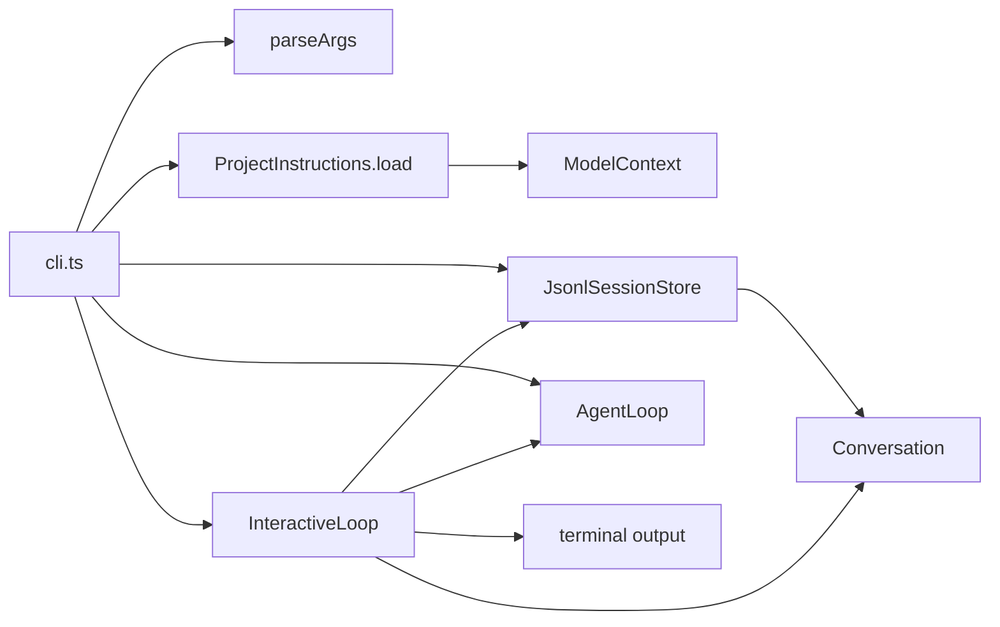

# Chapter 10: Build a Tiny Interactive Loop

Chapter 9 gave `ty-term` the last model-facing input it needed:

```text
Conversation -> persisted user, assistant, and tool messages
ModelContext -> project instructions loaded from AGENTS.md
AgentLoop -> one complete model/tool turn
```

That works for one-shot commands:

```bash
bun run dev -- --session lesson-9 "read file package.json"
```

But a terminal coding harness should not make the user restart the process for
every prompt. It should keep a conversation alive while the human keeps typing.

This chapter adds the smallest useful interactive mode:

```bash
bun run dev -- --interactive
```

or:

```bash
bun run dev -- -i
```

The new object is `InteractiveLoop`.

```text
InteractiveLoop owns repeated terminal turns.
cli.ts owns process setup and dependency composition.
```

That split matters. If we put the loop directly in `cli.ts`, the CLI becomes the
place where process arguments, project instructions, session persistence,
prompting, transcript display, and agent behavior all meet. That is exactly the
shape this refactor is avoiding.

## Where This Fits

At the end of Chapter 9, the main boundaries were:

```text
Conversation stores and renders messages.
AgentMessageFactory creates user, assistant, and tool messages.
ModelContext carries model-facing context.
ProjectInstructions loads AGENTS.md and creates ModelContext.
ToolRegistry owns lookup and dispatch.
JsonlSessionStore persists plain AgentMessage records.
AgentLoop orchestrates one turn.
cli.ts composes dependencies and prints one-shot output.
```

Chapter 10 keeps those boundaries and adds a terminal layer:

```text
parseArgs owns command-line flag parsing.
InteractiveLoop owns repeated prompting and per-turn display.
cli.ts wires everything together.
```

The flow becomes:



The invariant for this chapter is:

```text
InteractiveLoop coordinates repeated turns, but it does not create the world.
```

It receives `AgentLoop`, `Conversation`, `SessionStore`, and `ModelContext` from
`cli.ts`. It does not load `AGENTS.md`. Project instructions remain model
context, not session messages.

## The File Layout

Add a terminal folder:

```text
src/
  agent/
    agent-loop.ts
    agent-message.ts
    agent-message-factory.ts
    conversation.ts
  model/
    echo-model-client.ts
    model-client.ts
    model-context.ts
    openai-model-client.ts
  project/
    project-instructions.ts
  session/
    jsonl-session-store.ts
    session-store.ts
  terminal/
    interactive-loop.ts
    parse-args.ts
  tools/
    bash-tool.ts
    current-directory-tool.ts
    read-file-tool.ts
    tool.ts
    tool-registry.ts
    tool-request-parser.ts
  cli.ts
  index.ts
tests/
  interactive-loop.test.ts
```

`src/index.ts` stays a barrel file. It exports the terminal objects, but it does
not implement terminal behavior.

## Parse Arguments Outside The CLI

Argument parsing is small, but it is still behavior. Pull it out before adding
the loop so `cli.ts` does not become the dumping ground again.

Create `src/terminal/parse-args.ts`:

```ts
export interface ParsedArgs {
  readonly useOpenAI: boolean;
  readonly interactive: boolean;
  readonly sessionId?: string;
  readonly toolName?: string;
  readonly toolInput?: string;
  readonly prompt: string;
}

export function parseArgs(args: string[]): ParsedArgs {
  let useOpenAI = false;
  let interactive = false;
  let sessionId: string | undefined;
  let toolName: string | undefined;
  let toolInput: string | undefined;
  const promptParts: string[] = [];

  for (let index = 0; index < args.length; index += 1) {
    const arg = args[index];

    if (arg === "--openai") {
      useOpenAI = true;
      continue;
    }

    if (arg === "--interactive" || arg === "-i") {
      interactive = true;
      continue;
    }

    if (arg === "--session") {
      const nextArg = args[index + 1];

      if (!nextArg || nextArg.startsWith("--")) {
        throw new Error("--session requires an id.");
      }

      sessionId = nextArg;
      index += 1;
      continue;
    }

    if (arg === "--tool") {
      const nextArg = args[index + 1];

      if (!nextArg || nextArg.startsWith("--")) {
        throw new Error("--tool requires a tool name.");
      }

      toolName = nextArg;
      toolInput = args.slice(index + 2).join(" ");
      break;
    }

    promptParts.push(arg);
  }

  return {
    useOpenAI,
    interactive,
    sessionId,
    toolName,
    toolInput,
    prompt: promptParts.join(" "),
  };
}
```

This is not a parser framework. It is a tiny object boundary. The rest of the
program should receive a `ParsedArgs` value instead of reaching into
`process.argv`.

## InteractiveLoop Owns Repetition

`AgentLoop` already knows how to run one turn:

```text
prompt + conversation + model context -> appended messages
```

The interactive loop should not duplicate that. It should ask for a line, hand
that line to `AgentLoop`, display only the messages added by that turn, and
repeat.

Create `src/terminal/interactive-loop.ts`:

```ts
import { createInterface } from "node:readline/promises";
import type { AgentLoop } from "@/agent/agent-loop";
import type { Conversation } from "@/agent/conversation";
import type { ModelContext } from "@/model/model-context";
import type { SessionStore } from "@/session/session-store";

export interface InteractiveLoopOptions {
  readonly agentLoop: AgentLoop;
  readonly conversation: Conversation;
  readonly context: ModelContext;
  readonly input: NodeJS.ReadableStream;
  readonly output: NodeJS.WritableStream;
  readonly sessionStore?: SessionStore;
  readonly sessionId?: string;
}

export class InteractiveLoop {
  private readonly agentLoop: AgentLoop;
  private readonly conversation: Conversation;
  private readonly context: ModelContext;
  private readonly input: NodeJS.ReadableStream;
  private readonly output: NodeJS.WritableStream;
  private readonly sessionStore?: SessionStore;
  private readonly sessionId?: string;

  constructor(options: InteractiveLoopOptions) {
    this.agentLoop = options.agentLoop;
    this.conversation = options.conversation;
    this.context = options.context;
    this.input = options.input;
    this.output = options.output;
    this.sessionStore = options.sessionStore;
    this.sessionId = options.sessionId;
  }

  async run(): Promise<Conversation> {
    const readline = createInterface({
      input: this.input,
      output: this.output,
      prompt: "> ",
    });

    try {
      readline.prompt();

      for await (const line of readline) {
        const prompt = line.trim();

        if (this.shouldExit(prompt)) {
          break;
        }

        if (prompt.length === 0) {
          readline.prompt();
          continue;
        }

        await this.runPrompt(prompt);
        readline.prompt();
      }
    } finally {
      readline.close();
    }

    return this.conversation;
  }

  private shouldExit(prompt: string): boolean {
    return prompt === "/exit" || prompt === "/quit";
  }

  private async runPrompt(prompt: string): Promise<void> {
    const startingLength = this.conversation.length;

    await this.agentLoop.runTurn(this.conversation, prompt, this.context);

    const appendedMessages = this.conversation.messagesSince(startingLength);

    if (this.sessionStore && this.sessionId) {
      await this.sessionStore.append(this.sessionId, appendedMessages);
    }

    this.output.write(
      `${Conversation.fromMessages(appendedMessages).renderTranscript()}\n`,
    );
  }
}
```

This class owns the loop-specific decisions:

```text
Prompt repeatedly.
Ignore blank lines.
Exit on /exit or /quit.
Run one agent turn per line.
Persist only the messages appended by that line.
Display only the messages appended by that line.
```

It refuses to own everything else:

```text
It does not parse process arguments.
It does not load AGENTS.md.
It does not create tools.
It does not choose OpenAI vs Echo.
It does not know where session files live.
```

The most important line is:

```ts
const startingLength = this.conversation.length;
```

The loop records the conversation length before the turn. After `AgentLoop`
mutates the conversation, the loop asks for only the appended messages:

```ts
const appendedMessages = this.conversation.messagesSince(startingLength);
```

That gives the terminal a focused display while preserving the full in-memory
conversation.

## The CLI Becomes The Composition Root

Now update `src/cli.ts`. The CLI still has work to do, but the work is wiring:

```text
parse process args
validate flags
resolve project root
load project instructions
create ModelContext
create session store
create tools
create model client
create AgentLoop
create Conversation
choose one-shot or interactive execution
```

That is composition. The CLI is not the owner of the terminal loop.

```ts
#!/usr/bin/env bun

import { stdin, stdout } from "node:process";
import {
  AgentLoop,
  AgentMessageFactory,
  BashTool,
  Conversation,
  CurrentDirectoryTool,
  EchoModelClient,
  InteractiveLoop,
  JsonlSessionStore,
  OpenAIModelClient,
  ProjectInstructions,
  ReadFileTool,
  ToolRegistry,
  parseArgs,
  resolveProjectRoot,
  validateSessionId,
} from "@/index";

async function main(): Promise<void> {
  const parsed = parseArgs(process.argv.slice(2));
  const projectRoot = resolveProjectRoot();

  if (parsed.sessionId !== undefined) {
    validateSessionId(parsed.sessionId);
  }

  if (parsed.toolName) {
    const manualToolRegistry = new ToolRegistry([
      new CurrentDirectoryTool(projectRoot),
      new BashTool({ cwd: projectRoot }),
      new ReadFileTool(projectRoot),
    ]);

    const result = await manualToolRegistry.execute(
      parsed.toolName,
      parsed.toolInput,
    );

    process.stdout.write(`tool ${parsed.toolName}:\n${result}\n`);
    return;
  }

  if (!parsed.interactive && parsed.prompt.length === 0) {
    process.stderr.write(
      [
        'Usage: bun run dev -- [--session id] [--openai] "your prompt"',
        "       bun run dev -- --interactive",
        "       bun run dev -- --tool cwd",
        '       bun run dev -- --tool bash "pwd"',
        "       bun run dev -- --tool read_file package.json",
        "",
      ].join("\n"),
    );
    process.exit(1);
  }

  if (parsed.useOpenAI && !process.env.OPENAI_API_KEY) {
    process.stderr.write("OPENAI_API_KEY is required when using --openai.\n");
    process.exit(1);
  }

  const projectInstructions = await ProjectInstructions.load(projectRoot);
  const modelContext = projectInstructions.toModelContext();
  const messageFactory = new AgentMessageFactory();
  const modelClient = parsed.useOpenAI
    ? new OpenAIModelClient()
    : new EchoModelClient();
  const modelToolRegistry = new ToolRegistry([
    new CurrentDirectoryTool(projectRoot),
    new ReadFileTool(projectRoot),
  ]);
  const agentLoop = new AgentLoop(
    messageFactory,
    modelClient,
    modelToolRegistry,
  );
  const sessionStore = new JsonlSessionStore(projectRoot);
  const conversation = parsed.sessionId
    ? Conversation.fromMessages(await sessionStore.load(parsed.sessionId))
    : new Conversation();

  if (parsed.interactive) {
    await new InteractiveLoop({
      agentLoop,
      conversation,
      context: modelContext,
      input: stdin,
      output: stdout,
      sessionStore: parsed.sessionId ? sessionStore : undefined,
      sessionId: parsed.sessionId,
    }).run();
    return;
  }

  const startingLength = conversation.length;

  await agentLoop.runTurn(conversation, parsed.prompt, modelContext);

  if (parsed.sessionId) {
    await sessionStore.append(
      parsed.sessionId,
      conversation.messagesSince(startingLength),
    );
  }

  process.stdout.write(`${conversation.renderTranscript()}\n`);
}

main().catch((error: unknown) => {
  const message = error instanceof Error ? error.message : String(error);
  process.stderr.write(`${message}\n`);
  process.exit(1);
});
```

Notice what changed from Chapter 9:

```ts
if (parsed.interactive) {
  await new InteractiveLoop({
    agentLoop,
    conversation,
    context: modelContext,
    input: stdin,
    output: stdout,
    sessionStore: parsed.sessionId ? sessionStore : undefined,
    sessionId: parsed.sessionId,
  }).run();
  return;
}
```

The CLI creates the loop. The loop runs the repeated prompts.

The project-instruction rule from Chapter 9 is preserved:

```ts
const projectInstructions = await ProjectInstructions.load(projectRoot);
const modelContext = projectInstructions.toModelContext();
```

That context is passed into `InteractiveLoop`. The loop does not call
`ProjectInstructions.load()`, and the session store still persists only
conversation messages.

## Export The Terminal Boundary

Update `src/index.ts`:

```ts
export { AgentLoop } from "@/agent/agent-loop";
export type { AgentMessage, AgentRole } from "@/agent/agent-message";
export { AgentMessageFactory } from "@/agent/agent-message-factory";
export { Conversation } from "@/agent/conversation";
export { EchoModelClient } from "@/model/echo-model-client";
export type { ModelClient } from "@/model/model-client";
export { ModelContext } from "@/model/model-context";
export {
  OpenAIModelClient,
  buildModelInstructions,
  type OpenAIResponsesClient,
} from "@/model/openai-model-client";
export { ProjectInstructions } from "@/project/project-instructions";
export {
  JsonlSessionStore,
  validateSessionId,
} from "@/session/jsonl-session-store";
export type { SessionStore } from "@/session/session-store";
export { InteractiveLoop } from "@/terminal/interactive-loop";
export { parseArgs, type ParsedArgs } from "@/terminal/parse-args";
export {
  BashTool,
  formatCommandResult,
  runShellCommand,
  type CommandOptions,
  type CommandResult,
  type CommandRunner,
} from "@/tools/bash-tool";
export { CurrentDirectoryTool } from "@/tools/current-directory-tool";
export {
  ReadFileTool,
  resolveProjectFilePath,
  resolveProjectRoot,
} from "@/tools/read-file-tool";
export type { Tool } from "@/tools/tool";
export { ToolRegistry } from "@/tools/tool-registry";
export {
  ToolRequestParser,
  type ToolRequest,
} from "@/tools/tool-request-parser";
```

Again, the barrel exports names. It does not become the place where logic lives.

## Display Only The Current Turn

One-shot mode can render the whole conversation:

```ts
process.stdout.write(`${conversation.renderTranscript()}\n`);
```

Interactive mode should not redraw old turns every time. If the user has already
seen the earlier transcript, printing it again creates noise.

That is why `InteractiveLoop` renders only the appended messages:

```ts
const appendedMessages = this.conversation.messagesSince(startingLength);

this.output.write(
  `${Conversation.fromMessages(appendedMessages).renderTranscript()}\n`,
);
```

The full conversation is still preserved:

```text
Conversation object -> full in-memory state
SessionStore append -> durable copy of new messages
Terminal output -> only the latest turn
```

Those are three different responsibilities. They should not be collapsed into
one "print or save everything" helper.

## The Allowlist Still Matters

Interactive mode does not make the model more trusted.

There are still three execution paths:

```text
manual --tool mode       -> cwd, bash, read_file
one-shot model mode      -> cwd, read_file
interactive model mode   -> cwd, read_file
```

Manual `bash` remains available:

```bash
bun run dev -- --tool bash "pwd"
```

Model-driven `bash` remains unavailable because the model registry is created
without `BashTool`:

```ts
const modelToolRegistry = new ToolRegistry([
  new CurrentDirectoryTool(projectRoot),
  new ReadFileTool(projectRoot),
]);
```

The terminal loop reuses that registry. It does not widen the allowlist just
because the process stays alive.

## Test The Loop

The tests should target the new terminal boundary directly. They should not need
to spawn a child process to prove loop behavior.

Create `tests/interactive-loop.test.ts`:

```ts
import { readFile, writeFile } from "node:fs/promises";
import path from "node:path";
import { Readable, Writable } from "node:stream";
import { describe, expect, it } from "bun:test";
import {
  AgentLoop,
  AgentMessageFactory,
  Conversation,
  CurrentDirectoryTool,
  EchoModelClient,
  InteractiveLoop,
  JsonlSessionStore,
  ModelContext,
  ReadFileTool,
  ToolRegistry,
  parseArgs,
} from "@/index";
import { withTempProject } from "@tests/helpers";

function createOutputRecorder(): {
  output: NodeJS.WritableStream;
  read(): string;
} {
  let contents = "";
  const output = new Writable({
    write(chunk, _encoding, callback) {
      contents += chunk.toString();
      callback();
    },
  });

  return {
    output,
    read() {
      return contents;
    },
  };
}

function createAgentLoop(projectRoot: string): AgentLoop {
  return new AgentLoop(
    new AgentMessageFactory(),
    new EchoModelClient(),
    new ToolRegistry([
      new CurrentDirectoryTool(projectRoot),
      new ReadFileTool(projectRoot),
    ]),
  );
}
```

Test the flags first:

```ts
describe("parseArgs", () => {
  it("parses long and short interactive flags", () => {
    expect(parseArgs(["--interactive", "hello"])).toEqual({
      useOpenAI: false,
      interactive: true,
      prompt: "hello",
    });

    expect(parseArgs(["-i", "--session", "lesson-10"])).toEqual({
      useOpenAI: false,
      interactive: true,
      sessionId: "lesson-10",
      prompt: "",
    });
  });
});
```

Test multiple prompts in one process:

```ts
describe("InteractiveLoop", () => {
  it("keeps conversation in memory across prompts", async () => {
    await withTempProject(async (projectRoot) => {
      const output = createOutputRecorder();
      const conversation = new Conversation();

      await new InteractiveLoop({
        agentLoop: createAgentLoop(projectRoot),
        conversation,
        context: new ModelContext(),
        input: Readable.from(["hello\nagain\n/exit\n"]),
        output: output.output,
      }).run();

      expect(conversation.toMessages()).toEqual([
        { role: "user", content: "hello" },
        { role: "assistant", content: "agent heard: hello" },
        { role: "user", content: "again" },
        { role: "assistant", content: "agent heard: again" },
      ]);
    });
  });
});
```

Test exit behavior:

```ts
it("exits cleanly on /exit and /quit", async () => {
  await withTempProject(async (projectRoot) => {
    for (const command of ["/exit\n", "/quit\n"]) {
      const conversation = new Conversation();

      await new InteractiveLoop({
        agentLoop: createAgentLoop(projectRoot),
        conversation,
        context: new ModelContext(),
        input: Readable.from([command]),
        output: createOutputRecorder().output,
      }).run();

      expect(conversation.toMessages()).toEqual([]);
    }
  });
});
```

Test session resume and append:

```ts
it("resumes a session and appends only new turn messages", async () => {
  await withTempProject(async (projectRoot) => {
    const sessionStore = new JsonlSessionStore(projectRoot);
    await sessionStore.append("lesson-10", [
      { role: "user", content: "earlier" },
      { role: "assistant", content: "remembered" },
    ]);

    const conversation = Conversation.fromMessages(
      await sessionStore.load("lesson-10"),
    );

    await new InteractiveLoop({
      agentLoop: createAgentLoop(projectRoot),
      conversation,
      context: new ModelContext(),
      input: Readable.from(["new prompt\n/exit\n"]),
      output: createOutputRecorder().output,
      sessionStore,
      sessionId: "lesson-10",
    }).run();

    await expect(
      readFile(
        path.join(projectRoot, ".ty-term/sessions/lesson-10.jsonl"),
        "utf8",
      ),
    ).resolves.toBe(
      [
        '{"role":"user","content":"earlier"}',
        '{"role":"assistant","content":"remembered"}',
        '{"role":"user","content":"new prompt"}',
        '{"role":"assistant","content":"agent heard: new prompt"}',
        "",
      ].join("\n"),
    );
  });
});
```

Test display of appended messages only:

```ts
it("prints only messages appended by the current prompt", async () => {
  await withTempProject(async (projectRoot) => {
    const output = createOutputRecorder();
    const conversation = Conversation.fromMessages([
      { role: "user", content: "earlier" },
      { role: "assistant", content: "remembered" },
    ]);

    await new InteractiveLoop({
      agentLoop: createAgentLoop(projectRoot),
      conversation,
      context: new ModelContext(),
      input: Readable.from(["fresh\n/exit\n"]),
      output: output.output,
    }).run();

    expect(output.read()).toContain("user: fresh\n");
    expect(output.read()).toContain("assistant: agent heard: fresh\n");
    expect(output.read()).not.toContain("user: earlier\n");
    expect(output.read()).not.toContain("assistant: remembered\n");
  });
});
```

Test that project instructions stay out of persistence:

```ts
it("does not persist project instructions as session messages", async () => {
  await withTempProject(async (projectRoot) => {
    await writeFile(
      path.join(projectRoot, "AGENTS.md"),
      "Use short answers.\n",
    );
    const sessionStore = new JsonlSessionStore(projectRoot);
    const conversation = new Conversation();

    await new InteractiveLoop({
      agentLoop: createAgentLoop(projectRoot),
      conversation,
      context: new ModelContext({
        projectInstructions: "Use short answers.",
      }),
      input: Readable.from(["hello\n/exit\n"]),
      output: createOutputRecorder().output,
      sessionStore,
      sessionId: "lesson-10",
    }).run();

    const contents = await readFile(
      path.join(projectRoot, ".ty-term/sessions/lesson-10.jsonl"),
      "utf8",
    );

    expect(contents).toContain('"content":"hello"');
    expect(contents).not.toContain("Use short answers.");
  });
});
```

That last test carries forward Chapter 9's most important rule. Project
instructions influence model calls through `ModelContext`; they are not appended
to the conversation or JSONL session.

## Try It

Run the tests:

```bash
bun test
```

Run TypeScript:

```bash
bun run build
```

Start interactive mode with the echo model:

```bash
bun run dev -- --interactive
```

Expected shape:

```text
> hello
user: hello
assistant: agent heard: hello
>
```

Try the short flag:

```bash
bun run dev -- -i
```

Try a model-accessible tool:

```text
> where am I?
user: where am I?
assistant: TOOL cwd
tool cwd: /path/to/ty-term
assistant: saw tool cwd: /path/to/ty-term
>
```

Exit with:

```text
> /exit
```

Run interactive mode with durable history:

```bash
bun run dev -- --interactive --session lesson-10
```

Then inspect the JSONL file:

```bash
cat .ty-term/sessions/lesson-10.jsonl
```

Run a piped smoke test:

```bash
printf "hello\n/exit\n" | bun run dev -- --interactive --session smoke
```

Run with OpenAI:

```bash
OPENAI_API_KEY=... bun run dev -- --interactive --openai
```

## Verification

The intended checkpoint is:

```text
bun test: passed
bun run build: passed
```

Focused behavior should cover:

```text
parseArgs supports --interactive and -i
InteractiveLoop handles multiple prompts
InteractiveLoop exits on /exit and /quit
InteractiveLoop resumes a session
InteractiveLoop prints only appended messages
JsonlSessionStore persists messages but not project instructions
```

## What We Simplified

We use plain line input from `node:readline/promises`. There is no full-screen
TUI.

We render a text transcript after each prompt. There is no streaming token
display.

We still support only one tool request per turn because that is the current
limit of `AgentLoop`.

We do not add command history, editing shortcuts, colors, spinners, cancellation,
or background process management.

We load `AGENTS.md` once when the process starts. Restart the process to pick up
changes.

We append completed turns to JSONL. We do not persist partial turns if the
process crashes in the middle of a model call.

We keep `bash` out of the model registry. The interactive loop does not change
the safety boundary.

## Book Wrap-Up Checkpoint

At this point, `ty-term` has the spine of a tiny terminal coding harness:

- a TypeScript package rooted at `ty-term`
- a conversation representation
- a model client boundary
- an OpenAI-backed model path
- a no-key echo model for tests and learning
- a tool definition and registry
- manual tools for `cwd`, `bash`, and `read_file`
- model-driven tools for `cwd` and project-root-safe `read_file`
- a conservative model tool allowlist
- project-root-safe file reading
- JSONL session persistence
- root `AGENTS.md` loading as model context
- a one-shot CLI mode
- a tiny interactive loop

The harness is still intentionally small. It is not a production coding agent.
But the core boundaries are now visible:

```text
cli.ts
  -> parseArgs
  -> ProjectInstructions
  -> JsonlSessionStore
  -> ToolRegistry
  -> ModelClient
  -> AgentLoop
  -> InteractiveLoop
```

That is the teaching target of the book: each object has a job, and the terminal
experience is built by composing those jobs rather than jamming them into
`index.ts` or `cli.ts`.
