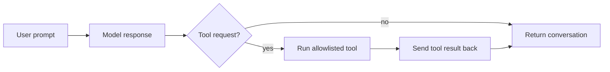

# Chapter 6: Let the Model Use Tools

## Where We Are

Chapter 5 gave the harness two ways to run tools:

- `cwd`, which returns the current working directory
- `bash`, which runs a manually requested shell command

Both tools are still outside the model loop. The human has to type:

```bash
npm run dev -- --tool cwd
```

This chapter lets the model request one safe tool from inside a normal turn.

The important constraint is that the model does not get the `bash` tool yet. A shell tool can change the machine, so it stays behind the manual `--tool bash` path from Chapter 5. The model only receives `cwd`, which is useful, deterministic, and easy to reason about.

## Learning Objective

Learn the smallest complete tool loop:



By the end, this command:

```bash
npm run dev -- "use the cwd tool"
```

prints a transcript like:

```text
user: use the cwd tool
assistant: TOOL cwd
tool cwd: /path/to/ty-term
assistant: saw tool cwd: /path/to/ty-term
```

## The Deliberate Simplification

Real coding agents usually use structured tool calls from the provider API. `pi-mono` routes those through a richer agent loop and executor boundary.

This book uses a plain text protocol first:

```text
TOOL cwd
TOOL bash: pwd
```

That is not the final design for a production harness, but it makes the control flow visible. The model asks for a tool, the harness parses the request, the registry enforces the allowlist, and the result becomes a `tool` message.

## Build The Slice

Change three files:

- `src/index.ts`
- `src/cli.ts`
- `tests/agent.test.ts`

No new dependencies are needed. Chapter 1 already installed everything used here.

## `src/index.ts`

Replace the file with this version:

```ts
import { spawn } from "node:child_process";
import OpenAI from "openai";

export type AgentRole = "user" | "assistant" | "tool";

export interface AgentMessage {
  role: AgentRole;
  content: string;
  name?: string;
}

export type Conversation = AgentMessage[];

export interface ModelClient {
  createResponse(prompt: string, conversation: Conversation): Promise<string>;
}

export interface ToolDefinition {
  name: string;
  description: string;
  execute(input?: string): Promise<string>;
}

export type ToolRegistry = ReadonlyMap<string, ToolDefinition>;

export interface ToolRequest {
  name: string;
  input?: string;
}

export interface CommandOptions {
  cwd?: string;
  timeoutMs?: number;
}

export function createUserMessage(content: string): AgentMessage {
  return { role: "user", content };
}

export function createAssistantMessage(content: string): AgentMessage {
  return { role: "assistant", content };
}

export function createToolMessage(name: string, content: string): AgentMessage {
  return { role: "tool", name, content };
}

export function createEchoModelClient(): ModelClient {
  return {
    async createResponse(
      prompt: string,
      conversation: Conversation,
    ): Promise<string> {
      const latestMessage = conversation.at(-1);

      if (latestMessage?.role === "tool") {
        return `saw tool ${latestMessage.name}: ${latestMessage.content}`;
      }

      const normalizedPrompt = prompt.toLowerCase();

      if (
        normalizedPrompt.includes("use the cwd tool") ||
        normalizedPrompt.includes("run pwd")
      ) {
        return "TOOL cwd";
      }

      return `agent heard: ${prompt}`;
    },
  };
}

export function createOpenAIModelClient(
  model = process.env.OPENAI_MODEL ?? "gpt-4.1-mini",
): ModelClient {
  const client = new OpenAI();

  return {
    async createResponse(
      prompt: string,
      conversation: Conversation,
    ): Promise<string> {
      const contextText = conversation
        .map((message) => {
          if (message.role === "tool") {
            return `tool ${message.name}: ${message.content}`;
          }

          return `${message.role}: ${message.content}`;
        })
        .join("\n");

      const response = await client.responses.create({
        model,
        instructions: [
          "You are connected to a tiny learning harness.",
          "If you need the current working directory, respond exactly: TOOL cwd",
          "Do not request bash commands.",
          "After a tool result appears, answer the user in normal text.",
        ].join("\n"),
        input: [contextText, prompt]
          .filter((part) => part.length > 0)
          .join("\n"),
      });

      return response.output_text;
    },
  };
}

export async function runTurn(
  conversation: Conversation,
  prompt: string,
  modelClient: ModelClient,
): Promise<Conversation> {
  const userMessage = createUserMessage(prompt);
  const assistantContent = await modelClient.createResponse(
    prompt,
    conversation,
  );
  const assistantMessage = createAssistantMessage(assistantContent);

  return [...conversation, userMessage, assistantMessage];
}

export async function runTurnWithTools(
  conversation: Conversation,
  prompt: string,
  modelClient: ModelClient,
  toolRegistry: ToolRegistry,
): Promise<Conversation> {
  const userMessage = createUserMessage(prompt);
  const afterUser = [...conversation, userMessage];

  const assistantContent = await modelClient.createResponse(prompt, afterUser);
  const assistantMessage = createAssistantMessage(assistantContent);
  const afterAssistant = [...afterUser, assistantMessage];

  const toolRequest = parseToolRequest(assistantContent);

  if (!toolRequest) {
    return afterAssistant;
  }

  const toolResult = await executeTool(
    toolRegistry,
    toolRequest.name,
    toolRequest.input,
  );
  const toolMessage = createToolMessage(toolRequest.name, toolResult);
  const afterTool = [...afterAssistant, toolMessage];

  const finalAssistantContent = await modelClient.createResponse("", afterTool);
  const finalAssistantMessage = createAssistantMessage(finalAssistantContent);

  return [...afterTool, finalAssistantMessage];
}

export function parseToolRequest(text: string): ToolRequest | undefined {
  const match = text.trim().match(/^TOOL ([a-zA-Z0-9_-]+)(?:\s*:\s*(.*))?$/);

  if (!match) {
    return undefined;
  }

  const [, name, input] = match;

  return {
    name,
    input: input && input.length > 0 ? input : undefined,
  };
}

export function renderTranscript(conversation: Conversation): string {
  return conversation
    .map((message) => {
      if (message.role === "tool") {
        return `tool ${message.name}: ${message.content}`;
      }

      return `${message.role}: ${message.content}`;
    })
    .join("\n");
}

export function createCurrentDirectoryTool(options?: {
  cwd?: string;
}): ToolDefinition {
  const cwd = options?.cwd ?? process.cwd();

  return {
    name: "cwd",
    description: "Return the current working directory.",
    async execute() {
      return cwd;
    },
  };
}

export async function executeCommand(
  command: string,
  options?: CommandOptions,
): Promise<string> {
  const timeoutMs = options?.timeoutMs ?? 5000;

  return new Promise((resolve, reject) => {
    let stdout = "";
    let stderr = "";
    let timedOut = false;

    const child = spawn(command, {
      cwd: options?.cwd,
      shell: true,
      stdio: ["ignore", "pipe", "pipe"],
    });

    const timeout = setTimeout(() => {
      timedOut = true;
      child.kill();
    }, timeoutMs);

    child.stdout.setEncoding("utf8");
    child.stderr.setEncoding("utf8");

    child.stdout.on("data", (chunk: string) => {
      stdout += chunk;
    });

    child.stderr.on("data", (chunk: string) => {
      stderr += chunk;
    });

    child.on("error", (error) => {
      clearTimeout(timeout);
      reject(error);
    });

    child.on("close", (code) => {
      clearTimeout(timeout);

      const exitCode = timedOut ? "timeout" : String(code ?? 0);

      resolve(
        [
          `exit code: ${exitCode}`,
          "stdout:",
          stdout.trimEnd(),
          "stderr:",
          stderr.trimEnd(),
        ].join("\n"),
      );
    });
  });
}

export function createBashTool(options?: CommandOptions): ToolDefinition {
  return {
    name: "bash",
    description: "Run a bash command and return exit code, stdout, and stderr.",
    async execute(input?: string) {
      if (!input || input.trim().length === 0) {
        throw new Error("bash tool requires a command.");
      }

      return executeCommand(input, options);
    },
  };
}

export function createToolRegistry(
  tools: readonly ToolDefinition[],
): ToolRegistry {
  const registry = new Map<string, ToolDefinition>();

  for (const tool of tools) {
    if (registry.has(tool.name)) {
      throw new Error(`Duplicate tool name: ${tool.name}`);
    }

    registry.set(tool.name, tool);
  }

  return registry;
}

export function getTool(
  registry: ToolRegistry,
  name: string,
): ToolDefinition | undefined {
  return registry.get(name);
}

export async function executeTool(
  registry: ToolRegistry,
  name: string,
  input?: string,
): Promise<string> {
  const tool = getTool(registry, name);

  if (!tool) {
    throw new Error(`Unknown tool: ${name}`);
  }

  return tool.execute(input);
}
```

## What Changed

`AgentRole` now includes `tool`:

```ts
export type AgentRole = "user" | "assistant" | "tool";
```

Tool messages also need a name:

```ts
export interface AgentMessage {
  role: AgentRole;
  content: string;
  name?: string;
}
```

The `name` is optional because user and assistant messages do not need it. A stricter design would use a discriminated union, but that would distract from the loop shape in this chapter.

The echo model is no longer just an echo. It has enough behavior to test the loop without calling a real provider:

```ts
if (latestMessage?.role === "tool") {
  return `saw tool ${latestMessage.name}: ${latestMessage.content}`;
}
```

That branch simulates the second model call, where the model receives a tool result and writes a final answer.

## The Tool Loop

The key function is `runTurnWithTools`:

```ts
export async function runTurnWithTools(
  conversation: Conversation,
  prompt: string,
  modelClient: ModelClient,
  toolRegistry: ToolRegistry,
): Promise<Conversation> {
  const userMessage = createUserMessage(prompt);
  const afterUser = [...conversation, userMessage];

  const assistantContent = await modelClient.createResponse(prompt, afterUser);
  const assistantMessage = createAssistantMessage(assistantContent);
  const afterAssistant = [...afterUser, assistantMessage];

  const toolRequest = parseToolRequest(assistantContent);

  if (!toolRequest) {
    return afterAssistant;
  }

  const toolResult = await executeTool(
    toolRegistry,
    toolRequest.name,
    toolRequest.input,
  );
  const toolMessage = createToolMessage(toolRequest.name, toolResult);
  const afterTool = [...afterAssistant, toolMessage];

  const finalAssistantContent = await modelClient.createResponse("", afterTool);
  const finalAssistantMessage = createAssistantMessage(finalAssistantContent);

  return [...afterTool, finalAssistantMessage];
}
```

There are two deliberate limits:

- It runs at most one tool per user turn.
- It sends the model a final tool result once, then stops.

Those limits keep accidental loops out of the first implementation. Later, a real loop can repeat this cycle until the model returns normal text, but only after the harness has stronger guardrails.

## `src/cli.ts`

Replace the file with this version:

```ts
#!/usr/bin/env node
import {
  type Conversation,
  createBashTool,
  createCurrentDirectoryTool,
  createEchoModelClient,
  createOpenAIModelClient,
  createToolRegistry,
  executeTool,
  renderTranscript,
  runTurnWithTools,
} from "./index.js";

interface ParsedArgs {
  useOpenAI: boolean;
  toolName?: string;
  toolInput?: string;
  prompt: string;
}

function parseArgs(args: string[]): ParsedArgs {
  let useOpenAI = false;
  let toolName: string | undefined;
  let toolInput: string | undefined;
  const promptParts: string[] = [];

  for (let index = 0; index < args.length; index += 1) {
    const arg = args[index];

    if (arg === "--openai") {
      useOpenAI = true;
      continue;
    }

    if (arg === "--tool") {
      toolName = args[index + 1];
      toolInput = args.slice(index + 2).join(" ");
      break;
    }

    promptParts.push(arg);
  }

  return { useOpenAI, toolName, toolInput, prompt: promptParts.join(" ") };
}

async function main(): Promise<void> {
  const parsed = parseArgs(process.argv.slice(2));

  if (parsed.toolName) {
    const registry = createToolRegistry([
      createCurrentDirectoryTool(),
      createBashTool(),
    ]);
    const result = await executeTool(
      registry,
      parsed.toolName,
      parsed.toolInput,
    );

    process.stdout.write(`tool ${parsed.toolName}:\n${result}\n`);
    return;
  }

  if (parsed.prompt.length === 0) {
    console.error('Usage: npm run dev -- [--openai] "your prompt"');
    process.exit(1);
  }

  if (parsed.useOpenAI && !process.env.OPENAI_API_KEY) {
    console.error("OPENAI_API_KEY is required when using --openai.");
    process.exit(1);
  }

  const modelClient = parsed.useOpenAI
    ? createOpenAIModelClient()
    : createEchoModelClient();
  const conversation: Conversation = [];
  const modelToolRegistry = createToolRegistry([createCurrentDirectoryTool()]);
  const nextConversation = await runTurnWithTools(
    conversation,
    parsed.prompt,
    modelClient,
    modelToolRegistry,
  );

  process.stdout.write(`${renderTranscript(nextConversation)}\n`);
}

main().catch((error: unknown) => {
  const message = error instanceof Error ? error.message : String(error);
  process.stderr.write(`${message}\n`);
  process.exitCode = 1;
});
```

The CLI now has two tool registries:

- Manual `--tool`: `cwd` and `bash`
- Model-driven prompt: `cwd` only

That split is the lesson. The registry is not just a lookup table. It is the capability boundary.

## `tests/agent.test.ts`

Replace the file with this version:

```ts
import { describe, expect, it } from "vitest";
import {
  type Conversation,
  createBashTool,
  createCurrentDirectoryTool,
  createEchoModelClient,
  createToolMessage,
  createToolRegistry,
  executeCommand,
  executeTool,
  getTool,
  parseToolRequest,
  renderTranscript,
  runTurn,
  runTurnWithTools,
} from "../src/index.js";

function nodeCommand(script: string): string {
  return `${JSON.stringify(process.execPath)} -e ${JSON.stringify(script)}`;
}

describe("agent turn", () => {
  it("keeps the normal prompt contract stable", async () => {
    const conversation = await runTurn([], "hello", createEchoModelClient());

    expect(renderTranscript(conversation)).toBe(
      "user: hello\nassistant: agent heard: hello",
    );
  });

  it("does not mutate the previous conversation", async () => {
    const original: Conversation = [{ role: "user", content: "earlier" }];

    await runTurn(original, "next", createEchoModelClient());

    expect(original).toEqual([{ role: "user", content: "earlier" }]);
  });
});

describe("tool-aware agent turn", () => {
  it("runs one requested cwd tool and adds the final assistant response", async () => {
    const registry = createToolRegistry([
      createCurrentDirectoryTool({ cwd: "/learn/harness" }),
    ]);

    const conversation = await runTurnWithTools(
      [],
      "use the cwd tool",
      createEchoModelClient(),
      registry,
    );

    expect(conversation).toEqual([
      { role: "user", content: "use the cwd tool" },
      { role: "assistant", content: "TOOL cwd" },
      { role: "tool", name: "cwd", content: "/learn/harness" },
      { role: "assistant", content: "saw tool cwd: /learn/harness" },
    ]);
  });

  it("does not run a tool when the assistant response is normal text", async () => {
    const registry = createToolRegistry([
      createCurrentDirectoryTool({ cwd: "/learn/harness" }),
    ]);

    const conversation = await runTurnWithTools(
      [],
      "hello",
      createEchoModelClient(),
      registry,
    );

    expect(renderTranscript(conversation)).toBe(
      "user: hello\nassistant: agent heard: hello",
    );
  });

  it("uses the registry as the allowlist", async () => {
    await expect(
      runTurnWithTools(
        [],
        "use the cwd tool",
        createEchoModelClient(),
        createToolRegistry([]),
      ),
    ).rejects.toThrow("Unknown tool: cwd");
  });
});

describe("tool request parsing", () => {
  it("parses a tool request without input", () => {
    expect(parseToolRequest("TOOL cwd")).toEqual({ name: "cwd" });
  });

  it("parses a tool request with input", () => {
    expect(parseToolRequest("TOOL bash: pwd")).toEqual({
      name: "bash",
      input: "pwd",
    });
  });

  it("ignores normal assistant text", () => {
    expect(parseToolRequest("agent heard: hello")).toBeUndefined();
  });
});

describe("transcript rendering", () => {
  it("renders tool messages with the tool name", () => {
    expect(renderTranscript([createToolMessage("cwd", "/learn/harness")])).toBe(
      "tool cwd: /learn/harness",
    );
  });
});

describe("tool registry", () => {
  it("stores tools by name", () => {
    const cwdTool = createCurrentDirectoryTool({ cwd: "/learn/harness" });
    const registry = createToolRegistry([cwdTool]);

    expect(getTool(registry, "cwd")).toBe(cwdTool);
  });

  it("rejects duplicate tool names", () => {
    expect(() =>
      createToolRegistry([
        createCurrentDirectoryTool({ cwd: "/one" }),
        createCurrentDirectoryTool({ cwd: "/two" }),
      ]),
    ).toThrow("Duplicate tool name: cwd");
  });

  it("executes a named tool", async () => {
    const registry = createToolRegistry([
      createCurrentDirectoryTool({ cwd: "/learn/harness" }),
    ]);

    await expect(executeTool(registry, "cwd")).resolves.toBe("/learn/harness");
  });

  it("passes input to a named tool", async () => {
    const registry = createToolRegistry([createBashTool({ timeoutMs: 1000 })]);

    await expect(
      executeTool(registry, "bash", nodeCommand("process.stdout.write('ok')")),
    ).resolves.toContain("stdout:\nok");
  });

  it("reports unknown tools", async () => {
    const registry = createToolRegistry([]);

    await expect(executeTool(registry, "missing")).rejects.toThrow(
      "Unknown tool: missing",
    );
  });
});

describe("bash command execution", () => {
  it("captures stdout with an exit code", async () => {
    const result = await executeCommand(
      nodeCommand("process.stdout.write('ok')"),
      { timeoutMs: 1000 },
    );

    expect(result).toContain("exit code: 0");
    expect(result).toContain("stdout:\nok");
    expect(result).toContain("stderr:");
  });

  it("captures stderr and nonzero exit codes", async () => {
    const result = await executeCommand(
      nodeCommand("process.stderr.write('bad'); process.exit(7)"),
      { timeoutMs: 1000 },
    );

    expect(result).toContain("exit code: 7");
    expect(result).toContain("stderr:\nbad");
  });

  it("rejects empty bash tool input", async () => {
    const bashTool = createBashTool();

    await expect(bashTool.execute()).rejects.toThrow(
      "bash tool requires a command.",
    );
  });
});
```

## Run It

Run the checks:

```bash
npm run build
npm test
```

Then run the normal path:

```bash
npm run dev -- "hello"
```

Expected shape:

```text
user: hello
assistant: agent heard: hello
```

Now run the tool path:

```bash
npm run dev -- "use the cwd tool"
```

Expected shape:

```text
user: use the cwd tool
assistant: TOOL cwd
tool cwd: /path/to/ty-term
assistant: saw tool cwd: /path/to/ty-term
```

The exact path depends on your machine.

## Reference Pointer

In `pi-mono`, compare this chapter with:

- `pi-mono/packages/agent/src/agent-loop.ts`
- `pi-mono/packages/coding-agent/src/core/agent-session.ts`
- `pi-mono/packages/coding-agent/src/core/bash-executor.ts`

The production code has a richer loop, typed tool calls, cancellation, session state, approvals, and better error handling. This chapter keeps only the central idea: the model can request an allowlisted capability, the harness executes it, and the result goes back into the conversation.

## What We Simplified

We used a text tool protocol instead of provider-native tool calling. We allowed only one tool call per turn. We exposed only `cwd` to the model and kept `bash` manual.

Those simplifications make the shape of the loop easy to inspect before the harness grows more realistic.

## Checkpoint

You now have:

- structured user, assistant, and tool messages
- a parser for simple tool requests
- a model-aware tool loop
- a registry acting as a model capability allowlist
- manual shell execution still separated from model-driven execution

The next chapter adds a safer and more useful coding-agent capability: reading files from the project.
