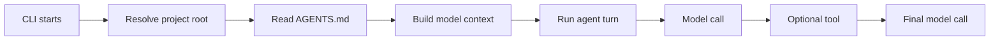

# Chapter 9: Load Project Instructions

## Where We Are

Chapter 8 gave `ty-term` durable memory:

```text
CLI starts -> load previous messages -> run one turn -> append new messages
```

The harness can remember a conversation, read project files, and let the model request safe tools. But it still treats every project the same. Real coding harnesses read local guidance before answering: style rules, test commands, workflow constraints, and repository-specific warnings.

This chapter adds the smallest useful version of that behavior:

```text
AGENTS.md at project root -> load once per CLI run -> pass into every model call
```

If `AGENTS.md` exists, the model receives its contents. If it is missing, the harness continues with empty instructions.

## Learning Objective

Learn how to keep project guidance separate from conversation history:



The invariant is:

> Project instructions are model context, not session messages.

That means `AGENTS.md` affects every model call, but the file is not appended to `.ty-term/sessions/*.jsonl`.

## Build The Slice

Change three files:

- `src/index.ts`
- `src/cli.ts`
- `tests/agent.test.ts`

No new dependencies are needed. This chapter uses Node’s standard library only.

## `src/index.ts`

Chapter 8 already imports `readFile`, so keep the filesystem import:

```ts
import { appendFile, mkdir, readFile } from "node:fs/promises";
```

Add model context near `Conversation`:

```ts
export interface ModelContext {
  projectInstructions: string;
}

export interface ModelClient {
  createResponse(
    prompt: string,
    conversation: Conversation,
    context: ModelContext,
  ): Promise<string>;
}

export interface OpenAIResponsesClient {
  responses: {
    create(options: {
      model: string;
      instructions: string;
      input: string;
    }): Promise<{ output_text: string }>;
  };
}

export interface TurnOptions {
  projectInstructions?: string;
}
```

`OpenAIResponsesClient` exists only to make the OpenAI client testable without calling the network.

Add instruction helpers after the message constructors:

```ts
export function createModelContext(options?: TurnOptions): ModelContext {
  return { projectInstructions: options?.projectInstructions ?? "" };
}

export function buildModelInstructions(projectInstructions = ""): string {
  const baseInstructions = [
    "You are connected to a tiny learning harness.",
    "If you need the current working directory, respond exactly: TOOL cwd",
    "If you need to read a project file, respond exactly: TOOL read_file: relative/path.txt",
    "Only request relative project file paths.",
    "Do not request bash commands.",
    "After a tool result appears, answer the user in normal text.",
  ].join("\n");

  if (projectInstructions.length === 0) {
    return baseInstructions;
  }

  return [
    baseInstructions,
    "",
    "Project instructions from AGENTS.md:",
    projectInstructions,
  ].join("\n");
}
```

The tool protocol stays in the base instructions. Project instructions are appended below it, so `AGENTS.md` cannot accidentally replace the harness rules.

Update the OpenAI client:

```ts
export function createOpenAIModelClient(
  model = process.env.OPENAI_MODEL ?? "gpt-4.1-mini",
  openAIClient?: OpenAIResponsesClient,
): ModelClient {
  const client = openAIClient ?? (new OpenAI() as OpenAIResponsesClient);

  return {
    async createResponse(
      prompt: string,
      conversation: Conversation,
      context: ModelContext,
    ): Promise<string> {
      const contextText = conversation
        .map((message) => {
          if (message.role === "tool") {
            return `tool ${message.name}: ${message.content}`;
          }

          return `${message.role}: ${message.content}`;
        })
        .join("\n");

      const response = await client.responses.create({
        model,
        instructions: buildModelInstructions(context.projectInstructions),
        input: [contextText, prompt]
          .filter((part) => part.length > 0)
          .join("\n"),
      });

      return response.output_text;
    },
  };
}
```

The API shape stays the same as earlier chapters: `responses.create({ model, instructions, input })`, then read `response.output_text`.

Update `runTurn`:

```ts
export async function runTurn(
  conversation: Conversation,
  prompt: string,
  modelClient: ModelClient,
  options?: TurnOptions,
): Promise<Conversation> {
  const userMessage = createUserMessage(prompt);
  const assistantContent = await modelClient.createResponse(
    prompt,
    conversation,
    createModelContext(options),
  );
  const assistantMessage = createAssistantMessage(assistantContent);

  return [...conversation, userMessage, assistantMessage];
}
```

Update `runTurnWithTools` so both model calls get the same context:

```ts
export async function runTurnWithTools(
  conversation: Conversation,
  prompt: string,
  modelClient: ModelClient,
  toolRegistry: ToolRegistry,
  options?: TurnOptions,
): Promise<Conversation> {
  const userMessage = createUserMessage(prompt);
  const afterUser = [...conversation, userMessage];
  const modelContext = createModelContext(options);

  const assistantContent = await modelClient.createResponse(
    prompt,
    afterUser,
    modelContext,
  );
  const assistantMessage = createAssistantMessage(assistantContent);
  const afterAssistant = [...afterUser, assistantMessage];

  const toolRequest = parseToolRequest(assistantContent);

  if (!toolRequest) {
    return afterAssistant;
  }

  const toolResult = await executeTool(
    toolRegistry,
    toolRequest.name,
    toolRequest.input,
  );
  const toolMessage = createToolMessage(toolRequest.name, toolResult);
  const afterTool = [...afterAssistant, toolMessage];

  const finalAssistantContent = await modelClient.createResponse(
    "",
    afterTool,
    modelContext,
  );
  const finalAssistantMessage = createAssistantMessage(finalAssistantContent);

  return [...afterTool, finalAssistantMessage];
}
```

Add the `AGENTS.md` loader after `resolveProjectRoot`:

```ts
export function getProjectInstructionsFilePath(projectRoot?: string): string {
  return path.join(resolveProjectRoot(projectRoot), "AGENTS.md");
}

export async function loadProjectInstructions(
  projectRoot?: string,
): Promise<string> {
  try {
    return await readFile(getProjectInstructionsFilePath(projectRoot), "utf8");
  } catch (error: unknown) {
    if (
      error &&
      typeof error === "object" &&
      "code" in error &&
      error.code === "ENOENT"
    ) {
      return "";
    }

    throw error;
  }
}
```

Only `ENOENT` becomes empty instructions. Other filesystem errors still fail, which is important because an unreadable or invalid `AGENTS.md` should not be silently ignored in model mode.

Finally, add `projectInstructions` to `SessionTurnOptions` and pass it through:

```ts
export interface SessionTurnOptions {
  projectRoot?: string;
  sessionId: string;
  prompt: string;
  modelClient: ModelClient;
  toolRegistry: ToolRegistry;
  projectInstructions?: string;
}
```

```ts
export async function runSessionTurn(
  options: SessionTurnOptions,
): Promise<SessionTurnResult> {
  const projectRoot = resolveProjectRoot(options.projectRoot);
  const previousConversation = await loadSessionMessages(
    projectRoot,
    options.sessionId,
  );
  const nextConversation = await runTurnWithTools(
    previousConversation,
    options.prompt,
    options.modelClient,
    options.toolRegistry,
    { projectInstructions: options.projectInstructions },
  );
  const appendedMessages = nextConversation.slice(previousConversation.length);

  await appendSessionMessages(projectRoot, options.sessionId, appendedMessages);

  return {
    previousConversation,
    nextConversation,
    appendedMessages,
  };
}
```

## The Context Boundary

The new type is intentionally small:

```ts
export interface ModelContext {
  projectInstructions: string;
}
```

We could add instructions as a `system` message in `Conversation`, but this book has not introduced system messages. A separate context object makes the boundary visible:

- `Conversation` is user, assistant, and tool history.
- `ModelContext` is extra information the model should see.
- `SessionStore` persists only conversation messages.

This keeps Chapter 8’s JSONL format unchanged.

## `src/cli.ts`

Add `loadProjectInstructions` to the imports:

```ts
import {
  type Conversation,
  createBashTool,
  createCurrentDirectoryTool,
  createEchoModelClient,
  createOpenAIModelClient,
  createReadFileTool,
  createToolRegistry,
  executeTool,
  loadProjectInstructions,
  renderTranscript,
  resolveProjectRoot,
  runSessionTurn,
  runTurnWithTools,
  validateSessionId,
} from "./index.js";
```

Then update `main`:

```ts
async function main(): Promise<void> {
  const parsed = parseArgs(process.argv.slice(2));
  const projectRoot = resolveProjectRoot();

  if (parsed.sessionId !== undefined) {
    validateSessionId(parsed.sessionId);
  }

  if (parsed.toolName) {
    const registry = createToolRegistry([
      createCurrentDirectoryTool({ cwd: projectRoot }),
      createBashTool({ cwd: projectRoot }),
      createReadFileTool({ projectRoot }),
    ]);
    const result = await executeTool(
      registry,
      parsed.toolName,
      parsed.toolInput,
    );

    process.stdout.write(`tool ${parsed.toolName}:\n${result}\n`);
    return;
  }

  if (parsed.prompt.length === 0) {
    console.error(
      'Usage: npm run dev -- [--session id] [--openai] "your prompt"',
    );
    process.exit(1);
  }

  if (parsed.useOpenAI && !process.env.OPENAI_API_KEY) {
    console.error("OPENAI_API_KEY is required when using --openai.");
    process.exit(1);
  }

  const projectInstructions = await loadProjectInstructions(projectRoot);
  const modelClient = parsed.useOpenAI
    ? createOpenAIModelClient()
    : createEchoModelClient();
  const modelToolRegistry = createToolRegistry([
    createCurrentDirectoryTool({ cwd: projectRoot }),
    createReadFileTool({ projectRoot }),
  ]);

  if (parsed.sessionId) {
    const result = await runSessionTurn({
      projectRoot,
      sessionId: parsed.sessionId,
      prompt: parsed.prompt,
      modelClient,
      toolRegistry: modelToolRegistry,
      projectInstructions,
    });

    process.stdout.write(`${renderTranscript(result.nextConversation)}\n`);
    return;
  }

  const conversation: Conversation = [];
  const nextConversation = await runTurnWithTools(
    conversation,
    parsed.prompt,
    modelClient,
    modelToolRegistry,
    { projectInstructions },
  );

  process.stdout.write(`${renderTranscript(nextConversation)}\n`);
}
```

Manual `--tool` mode returns before `loadProjectInstructions`. That is deliberate because tool mode does not call the model.

## `tests/agent.test.ts`

Add the new exports to the test imports:

```ts
import {
  type Conversation,
  type ModelClient,
  appendSessionMessages,
  buildModelInstructions,
  createBashTool,
  createCurrentDirectoryTool,
  createEchoModelClient,
  createOpenAIModelClient,
  createReadFileTool,
  createToolMessage,
  createToolRegistry,
  executeCommand,
  executeTool,
  getProjectInstructionsFilePath,
  getSessionFilePath,
  getTool,
  loadProjectInstructions,
  loadSessionMessages,
  parseToolRequest,
  renderTranscript,
  runSessionTurn,
  runTurn,
  runTurnWithTools,
  validateSessionId,
} from "../src/index.js";
```

Add a tiny recording model helper:

```ts
function createRecordingModelClient(responses: string[]): ModelClient & {
  calls: Array<Parameters<ModelClient["createResponse"]>>;
} {
  const calls: Array<Parameters<ModelClient["createResponse"]>> = [];

  return {
    calls,
    async createResponse(...args) {
      calls.push(args);

      return responses.shift() ?? "done";
    },
  };
}
```

Add these tests:

```ts
describe("project instructions", () => {
  it("loads AGENTS.md from the project root", async () => {
    await withTempProject(async (projectRoot) => {
      await writeFile(
        path.join(projectRoot, "AGENTS.md"),
        "Use small patches.\n",
        "utf8",
      );

      await expect(loadProjectInstructions(projectRoot)).resolves.toBe(
        "Use small patches.\n",
      );
      expect(getProjectInstructionsFilePath(projectRoot)).toBe(
        path.join(projectRoot, "AGENTS.md"),
      );
    });
  });

  it("returns empty instructions when AGENTS.md is missing", async () => {
    await withTempProject(async (projectRoot) => {
      await expect(loadProjectInstructions(projectRoot)).resolves.toBe("");
    });
  });

  it("passes project instructions to each model call without changing tool behavior", async () => {
    const modelClient = createRecordingModelClient(["TOOL cwd", "done"]);
    const registry = createToolRegistry([
      createCurrentDirectoryTool({ cwd: "/learn/harness" }),
    ]);

    const conversation = await runTurnWithTools(
      [],
      "where am I?",
      modelClient,
      registry,
      { projectInstructions: "Prefer short answers.\n" },
    );

    expect(conversation).toEqual([
      { role: "user", content: "where am I?" },
      { role: "assistant", content: "TOOL cwd" },
      { role: "tool", name: "cwd", content: "/learn/harness" },
      { role: "assistant", content: "done" },
    ]);
    expect(modelClient.calls).toHaveLength(2);
    expect(modelClient.calls[0][2]).toEqual({
      projectInstructions: "Prefer short answers.\n",
    });
    expect(modelClient.calls[1][2]).toEqual({
      projectInstructions: "Prefer short answers.\n",
    });
  });

  it("passes project instructions through session turns without persisting them", async () => {
    await withTempProject(async (projectRoot) => {
      const modelClient = createRecordingModelClient(["agent noted"]);

      const result = await runSessionTurn({
        projectRoot,
        sessionId: "lesson-9",
        prompt: "hello",
        modelClient,
        toolRegistry: createToolRegistry([]),
        projectInstructions: "Follow AGENTS.md.\n",
      });

      expect(modelClient.calls[0][2]).toEqual({
        projectInstructions: "Follow AGENTS.md.\n",
      });
      expect(result.appendedMessages).toEqual([
        { role: "user", content: "hello" },
        { role: "assistant", content: "agent noted" },
      ]);
      await expect(
        readFile(getSessionFilePath(projectRoot, "lesson-9"), "utf8"),
      ).resolves.toBe(
        '{"role":"user","content":"hello"}\n{"role":"assistant","content":"agent noted"}\n',
      );
    });
  });

  it("adds AGENTS.md content to OpenAI instructions and keeps transcript input separate", async () => {
    const calls: Array<{
      model: string;
      instructions: string;
      input: string;
    }> = [];
    const modelClient = createOpenAIModelClient("test-model", {
      responses: {
        async create(options) {
          calls.push(options);

          return { output_text: "ok" };
        },
      },
    });

    await runTurnWithTools(
      [{ role: "assistant", content: "earlier" }],
      "hello",
      modelClient,
      createToolRegistry([]),
      { projectInstructions: "Use repo-local conventions.\n" },
    );

    expect(calls).toEqual([
      {
        model: "test-model",
        instructions: buildModelInstructions("Use repo-local conventions.\n"),
        input: "assistant: earlier\nuser: hello\nhello",
      },
    ]);
  });
});
```

The recording model is better than changing the echo model here. It proves context is passed through without making `TOOL cwd` or `TOOL read_file: ...` harder to parse.

## Run It

Run the tests:

```bash
npm test
```

Run TypeScript:

```bash
npm run build -- --noEmit --pretty false
```

Create project instructions:

```bash
printf "Use small patches.\n" > AGENTS.md
```

Run a normal prompt:

```bash
npm run dev -- "hello"
```

Expected shape with the echo model:

```text
user: hello
assistant: agent heard: hello
```

The echo model does not display instructions directly in this verified version. The tests use a recording model to prove instructions are passed to the model context. With OpenAI, the instructions are included in the `instructions` field:

```bash
OPENAI_API_KEY=... npm run dev -- --openai "summarize the project rules"
```

Run with a session:

```bash
npm run dev -- --session lesson-9 "hello"
```

Inspect the JSONL:

```bash
cat .ty-term/sessions/lesson-9.jsonl
```

The session stores user, assistant, and tool messages. It does not store `AGENTS.md` as its own message.

Try the manual tool path:

```bash
npm run dev -- --tool read_file AGENTS.md
```

Manual tool mode can read the file because `read_file` is a tool, but it skips project instruction loading because no model call happens.

## Verification

The chapter implementation was checked in a scratch package:

```text
npm test: passed, 36 tests
npm run build -- --noEmit --pretty false: passed
CLI smoke: passed
```

The CLI smoke checks confirmed:

- session create/resume still works
- `read_file` still works
- JSONL session output is unchanged
- manual `--tool cwd` succeeds even when `AGENTS.md` is a directory, proving tool mode does not load instructions

## Reference Pointer

In `pi-mono`, compare this chapter with:

- `pi-mono/packages/coding-agent/src/core/resource-loader.ts`
- `pi-mono/packages/coding-agent/src/core/system-prompt.ts`
- `pi-mono/packages/coding-agent/src/cli/args.ts`
- `pi-mono/packages/coding-agent/src/core/agent-session.ts`

The real project discovers more context files, folds them into a richer system prompt, and includes working directory, tools, date, skills, extensions, and flags such as no-context-file modes. This chapter keeps one idea: read root `AGENTS.md` and include it in every model call.

## What We Simplified

We load only `AGENTS.md` from the project root. We do not search parent directories.

We do not support global config files, alternate filenames, or a `--no-context-files` flag.

We do not add instructions to session JSONL. Each run loads the current file again.

We keep model instructions as a plain string, because provider-native structured prompts would distract from the boundary.

## Checkpoint

You now have:

- `AGENTS.md` loading from the project root
- empty instructions when the file is missing
- model context passed through normal turns
- model context passed through session turns
- OpenAI instructions that preserve the tool protocol
- no changes to the JSONL session format

The harness now has memory and project-specific guidance. Chapter 10 turns the one-shot CLI into a tiny interactive loop.
