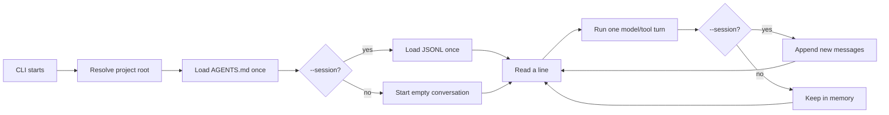

# Chapter 10: Build a Tiny Interactive Loop

## Where We Are

Chapter 9 gave `ty-term` the main pieces of a tiny coding harness:

```text
conversation history -> optional JSONL session
project root -> AGENTS.md model context
model turn -> allowlisted tool registry
```

But the CLI still behaves like a one-shot command. Every prompt starts a new process:

```bash
npm run dev -- "hello"
npm run dev -- --session lesson-9 "what did I say?"
```

That is useful for tests, but a terminal harness should stay alive while the human keeps asking questions.

This chapter adds the smallest interactive mode:

```bash
npm run dev -- --interactive
```

or:

```bash
npm run dev -- -i
```

Inside that process, `ty-term` keeps an in-memory conversation across prompts. If `--session <id>` is supplied, it also appends each completed turn to JSONL.

## Learning Objective

Learn the difference between a one-shot turn and a process-level loop:



The invariant is:

> Interactive mode owns the conversation between prompts. A session file is only the optional durable copy.

## Build The Slice

Change two source files and the tests:

- `src/cli.ts`
- `tests/agent.test.ts`

`src/index.ts` does not need new domain logic. The interactive loop is CLI behavior, so it can live in `cli.ts` for now.

No new dependencies are needed. This chapter uses `node:readline/promises`.

## `src/cli.ts`

Add readline and direct-run imports:

```ts
#!/usr/bin/env node
import { stdin, stdout } from "node:process";
import { createInterface } from "node:readline/promises";
import { fileURLToPath } from "node:url";
import path from "node:path";
```

Keep the existing imports from `index.ts`, and add the types and helpers needed by the loop:

```ts
import {
  type Conversation,
  type ModelClient,
  type ToolRegistry,
  appendSessionMessages,
  createBashTool,
  createCurrentDirectoryTool,
  createEchoModelClient,
  createOpenAIModelClient,
  createReadFileTool,
  createToolRegistry,
  executeTool,
  loadProjectInstructions,
  loadSessionMessages,
  renderTranscript,
  resolveProjectRoot,
  runSessionTurn,
  runTurnWithTools,
  validateSessionId,
} from "./index.js";
```

Extend parsed args:

```ts
interface ParsedArgs {
  useOpenAI: boolean;
  interactive: boolean;
  sessionId?: string;
  toolName?: string;
  toolInput?: string;
  prompt: string;
}
```

Add an exported loop options type. Exporting it makes the loop testable without spawning a child process:

```ts
export interface InteractiveLoopOptions {
  conversation: Conversation;
  input: NodeJS.ReadableStream;
  output: NodeJS.WritableStream;
  modelClient: ModelClient;
  projectRoot: string;
  projectInstructions: string;
  toolRegistry: ToolRegistry;
  sessionId?: string;
}
```

Update `parseArgs`:

```ts
export function parseArgs(args: string[]): ParsedArgs {
  let useOpenAI = false;
  let interactive = false;
  let sessionId: string | undefined;
  let toolName: string | undefined;
  let toolInput: string | undefined;
  const promptParts: string[] = [];

  for (let index = 0; index < args.length; index += 1) {
    const arg = args[index];

    if (arg === "--openai") {
      useOpenAI = true;
      continue;
    }

    if (arg === "--interactive" || arg === "-i") {
      interactive = true;
      continue;
    }

    if (arg === "--session") {
      const nextArg = args[index + 1];

      if (!nextArg || nextArg.startsWith("--")) {
        throw new Error("--session requires an id.");
      }

      sessionId = nextArg;
      index += 1;
      continue;
    }

    if (arg === "--tool") {
      toolName = args[index + 1];
      toolInput = args.slice(index + 2).join(" ");
      break;
    }

    promptParts.push(arg);
  }

  return {
    useOpenAI,
    interactive,
    sessionId,
    toolName,
    toolInput,
    prompt: promptParts.join(" "),
  };
}
```

Add the interactive loop:

```ts
export async function runInteractiveLoop(
  options: InteractiveLoopOptions,
): Promise<Conversation> {
  let conversation = options.conversation;
  const readline = createInterface({
    input: options.input,
    output: options.output,
    prompt: "> ",
  });
  let closed = false;

  readline.once("close", () => {
    closed = true;
  });

  try {
    readline.prompt();

    for await (const line of readline) {
      const prompt = line.trim();

      if (prompt === "/exit") {
        break;
      }

      if (prompt.length === 0) {
        if (!closed) {
          readline.prompt();
        }
        continue;
      }

      const nextConversation = await runTurnWithTools(
        conversation,
        prompt,
        options.modelClient,
        options.toolRegistry,
        { projectInstructions: options.projectInstructions },
      );
      const appendedMessages = nextConversation.slice(conversation.length);

      if (options.sessionId) {
        await appendSessionMessages(
          options.projectRoot,
          options.sessionId,
          appendedMessages,
        );
      }

      options.output.write(`${renderTranscript(appendedMessages)}\n`);
      conversation = nextConversation;

      if (!closed) {
        readline.prompt();
      }
    }
  } finally {
    readline.close();
  }

  return conversation;
}
```

Two details matter:

- The loop uses `for await (const line of readline)` so EOF and Ctrl-D end naturally.
- It tracks `closed` before prompting again, because prompting after a piped input closes can throw.

Update `main` so interactive mode is another model path:

```ts
async function main(): Promise<void> {
  const parsed = parseArgs(process.argv.slice(2));
  const projectRoot = resolveProjectRoot();

  if (parsed.sessionId !== undefined) {
    validateSessionId(parsed.sessionId);
  }

  if (parsed.toolName) {
    const registry = createToolRegistry([
      createCurrentDirectoryTool({ cwd: projectRoot }),
      createBashTool({ cwd: projectRoot }),
      createReadFileTool({ projectRoot }),
    ]);
    const result = await executeTool(
      registry,
      parsed.toolName,
      parsed.toolInput,
    );

    process.stdout.write(`tool ${parsed.toolName}:\n${result}\n`);
    return;
  }

  if (!parsed.interactive && parsed.prompt.length === 0) {
    console.error(
      'Usage: npm run dev -- [--session id] [--openai] [--interactive] "your prompt"',
    );
    process.exit(1);
  }

  if (parsed.useOpenAI && !process.env.OPENAI_API_KEY) {
    console.error("OPENAI_API_KEY is required when using --openai.");
    process.exit(1);
  }

  const projectInstructions = await loadProjectInstructions(projectRoot);
  const modelClient = parsed.useOpenAI
    ? createOpenAIModelClient()
    : createEchoModelClient();
  const modelToolRegistry = createToolRegistry([
    createCurrentDirectoryTool({ cwd: projectRoot }),
    createReadFileTool({ projectRoot }),
  ]);

  if (parsed.interactive) {
    const conversation = parsed.sessionId
      ? await loadSessionMessages(projectRoot, parsed.sessionId)
      : [];

    await runInteractiveLoop({
      conversation,
      input: stdin,
      output: stdout,
      modelClient,
      projectRoot,
      projectInstructions,
      toolRegistry: modelToolRegistry,
      sessionId: parsed.sessionId,
    });
    return;
  }

  if (parsed.sessionId) {
    const result = await runSessionTurn({
      projectRoot,
      sessionId: parsed.sessionId,
      prompt: parsed.prompt,
      modelClient,
      toolRegistry: modelToolRegistry,
      projectInstructions,
    });

    process.stdout.write(`${renderTranscript(result.nextConversation)}\n`);
    return;
  }

  const conversation: Conversation = [];
  const nextConversation = await runTurnWithTools(
    conversation,
    parsed.prompt,
    modelClient,
    modelToolRegistry,
    { projectInstructions },
  );

  process.stdout.write(`${renderTranscript(nextConversation)}\n`);
}
```

End the file with a direct-run guard:

```ts
const isDirectRun =
  process.argv[1] !== undefined &&
  path.resolve(process.argv[1]) === fileURLToPath(import.meta.url);

if (isDirectRun) {
  main().catch((error: unknown) => {
    const message = error instanceof Error ? error.message : String(error);
    process.stderr.write(`${message}\n`);
    process.exitCode = 1;
  });
}
```

This lets tests import `parseArgs` and `runInteractiveLoop` without running the CLI.

## Render Only New Messages

One-shot mode renders the whole conversation because there is only one command:

```ts
process.stdout.write(`${renderTranscript(result.nextConversation)}\n`);
```

Interactive mode renders only the messages created by the current prompt:

```ts
const appendedMessages = nextConversation.slice(conversation.length);
options.output.write(`${renderTranscript(appendedMessages)}\n`);
```

The full conversation still lives in memory. The terminal display stays focused on the latest turn.

## The Allowlist Still Matters

There are now three execution paths:

```text
manual --tool mode       -> cwd, bash, read_file
one-shot model mode      -> cwd, read_file
interactive model mode   -> cwd, read_file
```

Manual `bash` remains available for direct inspection:

```bash
npm run dev -- --tool bash "pwd"
```

Model-driven `bash` remains unavailable. Interactive mode must not widen the model’s authority just because the process stays alive longer.

## `tests/agent.test.ts`

Add stream imports:

```ts
import { Readable, Writable } from "node:stream";
```

Import the CLI helpers:

```ts
import { parseArgs, runInteractiveLoop } from "../src/cli.js";
```

Add an output recorder:

```ts
function createMemoryOutput(): {
  output: NodeJS.WritableStream;
  read(): string;
} {
  let contents = "";
  const output = new Writable({
    write(chunk, _encoding, callback) {
      contents += chunk.toString();
      callback();
    },
  });

  return {
    output,
    read() {
      return contents;
    },
  };
}
```

Add focused tests:

```ts
describe("chapter 10 interactive loop", () => {
  it("parses long and short interactive flags", () => {
    expect(parseArgs(["--interactive", "hello"])).toMatchObject({
      interactive: true,
      prompt: "hello",
    });
    expect(parseArgs(["-i", "--session", "lesson-10"])).toMatchObject({
      interactive: true,
      sessionId: "lesson-10",
      prompt: "",
    });
  });

  it("keeps conversation in memory across prompts", async () => {
    await withTempProject(async (projectRoot) => {
      const modelClient = createRecordingModelClient(["first", "second"]);
      const memory = createMemoryOutput();

      const conversation = await runInteractiveLoop({
        conversation: [],
        input: Readable.from(["hello\nagain\n/exit\n"]),
        output: memory.output,
        modelClient,
        projectRoot,
        projectInstructions: "Use short answers.\n",
        toolRegistry: createToolRegistry([
          createCurrentDirectoryTool({ cwd: projectRoot }),
          createReadFileTool({ projectRoot }),
        ]),
      });

      expect(conversation).toEqual([
        { role: "user", content: "hello" },
        { role: "assistant", content: "first" },
        { role: "user", content: "again" },
        { role: "assistant", content: "second" },
      ]);
      expect(memory.read()).toContain("assistant: first\n");
      expect(memory.read()).toContain("assistant: second\n");
    });
  });

  it("loads a session once and appends only interactive turn messages", async () => {
    await withTempProject(async (projectRoot) => {
      await appendSessionMessages(projectRoot, "lesson-10", [
        { role: "user", content: "earlier" },
        { role: "assistant", content: "remembered" },
      ]);

      const previousConversation = await loadSessionMessages(
        projectRoot,
        "lesson-10",
      );
      const modelClient = createRecordingModelClient(["fresh"]);

      await runInteractiveLoop({
        conversation: previousConversation,
        input: Readable.from(["new prompt\n/exit\n"]),
        output: createMemoryOutput().output,
        modelClient,
        projectRoot,
        projectInstructions: "",
        toolRegistry: createToolRegistry([
          createCurrentDirectoryTool({ cwd: projectRoot }),
          createReadFileTool({ projectRoot }),
        ]),
        sessionId: "lesson-10",
      });

      await expect(
        readFile(getSessionFilePath(projectRoot, "lesson-10"), "utf8"),
      ).resolves.toBe(
        [
          '{"role":"user","content":"earlier"}',
          '{"role":"assistant","content":"remembered"}',
          '{"role":"user","content":"new prompt"}',
          '{"role":"assistant","content":"fresh"}',
          "",
        ].join("\n"),
      );
    });
  });

  it("exits cleanly on /exit and on EOF", async () => {
    await withTempProject(async (projectRoot) => {
      const registry = createToolRegistry([
        createCurrentDirectoryTool({ cwd: projectRoot }),
        createReadFileTool({ projectRoot }),
      ]);

      await expect(
        runInteractiveLoop({
          conversation: [],
          input: Readable.from(["/exit\n"]),
          output: createMemoryOutput().output,
          modelClient: createEchoModelClient(),
          projectRoot,
          projectInstructions: "",
          toolRegistry: registry,
        }),
      ).resolves.toEqual([]);

      await expect(
        runInteractiveLoop({
          conversation: [],
          input: Readable.from([]),
          output: createMemoryOutput().output,
          modelClient: createEchoModelClient(),
          projectRoot,
          projectInstructions: "",
          toolRegistry: registry,
        }),
      ).resolves.toEqual([]);
    });
  });

  it("lets the model use cwd and read_file but not bash", async () => {
    await withTempProject(async (projectRoot) => {
      await writeFile(path.join(projectRoot, "note.txt"), "hello file\n");
      const registry = createToolRegistry([
        createCurrentDirectoryTool({ cwd: projectRoot }),
        createReadFileTool({ projectRoot }),
      ]);

      await expect(
        runTurnWithTools(
          [],
          "read file note.txt",
          createEchoModelClient(),
          registry,
        ),
      ).resolves.toEqual([
        { role: "user", content: "read file note.txt" },
        { role: "assistant", content: "TOOL read_file: note.txt" },
        { role: "tool", name: "read_file", content: "hello file\n" },
        { role: "assistant", content: "saw tool read_file: hello file\n" },
      ]);

      const bashRequestingModel = createRecordingModelClient([
        "TOOL bash: pwd",
      ]);
      await expect(
        runTurnWithTools([], "try bash", bashRequestingModel, registry),
      ).rejects.toThrow("Unknown tool: bash");
    });
  });
});
```

## Try It

Run the tests:

```bash
npm test
```

Run TypeScript:

```bash
npm run build -- --noEmit --pretty false
```

Start interactive mode with the echo model:

```bash
npm run dev -- --interactive
```

Expected shape:

```text
> hello
user: hello
assistant: agent heard: hello
>
```

Try the short flag:

```bash
npm run dev -- -i
```

Try an allowlisted tool:

```text
> use the cwd tool
user: use the cwd tool
assistant: TOOL cwd
tool cwd: /path/to/ty-term
assistant: saw tool cwd: /path/to/ty-term
>
```

Exit with:

```text
> /exit
```

Ctrl-D exits by closing stdin. Blank lines simply reprompt in the verified implementation.

Run interactive mode with a durable session:

```bash
npm run dev -- --interactive --session lesson-10
```

Then inspect:

```bash
cat .ty-term/sessions/lesson-10.jsonl
```

Run with OpenAI:

```bash
OPENAI_API_KEY=... npm run dev -- --interactive --openai
```

Run a quick piped smoke test:

```bash
printf "hello\n/exit\n" | npm run dev -- --interactive --session smoke
```

## Verification

The chapter implementation was checked in a scratch package:

```text
npm test: passed, 7 focused tests
npm run build -- --noEmit --pretty false: passed
CLI smoke: passed
```

CLI smoke checks covered:

- piped interactive input with `/exit`
- interactive `--session` JSONL appends
- one-shot `read_file`
- manual `--tool bash`

## Reference Pointer

In `pi-mono`, compare this chapter with:

- `pi-mono/packages/agent/src/agent-loop.ts`
- `pi-mono/packages/coding-agent/src/core/agent-session.ts`
- `pi-mono/packages/coding-agent/src/core/bash-executor.ts`
- `pi-mono/packages/tui/src/`

The real project has a much richer loop: streaming events, cancellation, terminal UI state, command approval, background process handling, structured tool calls, and careful session orchestration.

This chapter keeps one idea:

> A terminal harness is a process that repeatedly accepts human input, runs the same agent turn machinery, and carries conversation state forward.

## What We Simplified

We use plain line input. There is no full-screen TUI.

We render a text transcript after each prompt. There is no streaming token display.

We support only one tool call per turn because that is still the limit of `runTurnWithTools`.

We do not add command history, editing shortcuts, colors, spinners, or cancellation.

We load `AGENTS.md` once when the process starts. Restart the process to pick up changes.

We append completed turns to JSONL. We do not persist partial turns if the process crashes in the middle of a model call.

We keep `bash` out of the model registry. The interactive loop does not change the safety boundary.

## Book Wrap-Up Checkpoint

At this point, `ty-term` has the spine of a tiny terminal coding harness:

- a TypeScript package rooted at `ty-term`
- a conversation representation
- a model client boundary
- an OpenAI-backed model path
- a no-key echo model for tests and learning
- a tool definition and registry
- manual tools for `cwd`, `bash`, and `read_file`
- model-driven tools for `cwd` and project-root-safe `read_file`
- a conservative model tool allowlist
- project-root-safe file reading
- JSONL session persistence
- root `AGENTS.md` loading
- a one-shot CLI mode
- a tiny interactive loop

The harness is still intentionally small. It is not a production coding agent. But the core boundaries are visible:

```text
CLI
  -> project context
  -> session history
  -> model client
  -> tool registry
  -> turn loop
  -> transcript/session output
```

That is the teaching target of the book.
